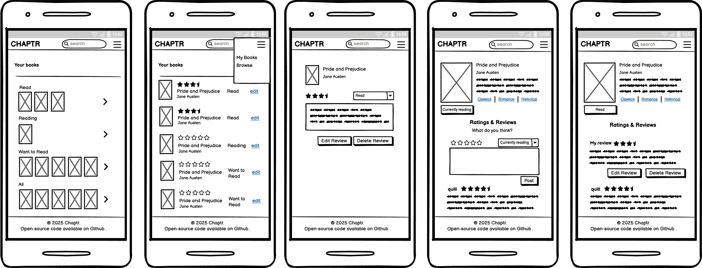
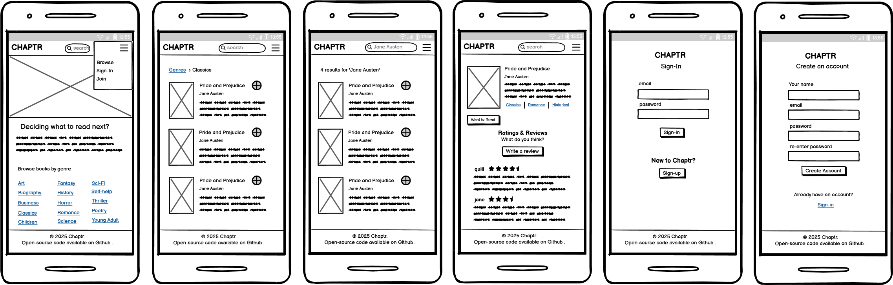

# Chaptr

**Chaptr** is a minimalist book-tracking web app built to help readers organize and reflect on their reading journey. Developed as a full-stack project, it highlights key features such as book categorization, rating, and commenting using modern web technologies.

Unlike feature-heavy platforms, Chaptr focuses on simplicity, allowing users to manage their reading lists (To Read, Reading, Read), rate completed books, and engage through comments in a clean, distraction-free interface.

---

## Target Audience

Chaptr is built for individual readers who want a focused, user-friendly space to log their reading habits without social clutter or complex features.

---
## Site Goal

To create a fully functional, database-backed full-stack application that:
- Demonstrates CRUD operations across multiple models
- Integrates external APIs (Google Books)
- Implements authentication, permissions, and user-specific data
- Prioritizes UX, accessibility, and responsive design

---

## Requirements Overview

Below is a summary of the planned development scope using Agile epics, user stories, and tasks.

---

### Epic 1: [Book Discovery and Browsing](#1)

**Goal**: Enable users to explore the book catalog using a search interface powered by the Google Books API.

#### [Search for books by title, author](#6)

**Technical Tasks**
- [Implement search form and view](#19)
- [Integrate Google Books API](#20)
- [Display search results](#21)

#### [View book details](#7)

**Technical Tasks**
- [Create book detail view](#22)
- [Style Book Detail Page](#23)
- [Populate data from API or local cache](#24)

#### [View comments on books](#8)

**Technical Tasks**
- [Create comment model and link to book](#27)
- [Display comments in detail template](#28)

#### [Prompt login when guests try to interact](#9)

**Technical Tasks**
- [Add Login Checks to Views](#25)
- [Add Login Prompt Messaging](#26)

---
### Epic 2: [User Authentication and Permissions](#2)

**Goal**: Set up account registration, login/logout, and protect user actions.

#### [Register an account](#10)

**Technical Tasks:**
- [Create Registration Form and View](#29)
- [Handle Form Validation and Feedback](#30)
- [Link Registration in Navbar](#31)

#### [Log in and log out securely](#11)

**Technical Tasks:**
- [Create login and logout views](#32)
- [Update navbar based on auth status](#33)
- [Handle redirection after login/logout](#34)

#### [Restrict book interactions to authenticated users](#12)

**Technical Tasks:**
- [Add `@login_required` to protected views](#36)
- [Update templates to show/hide based on login messages](#35)

---

### Epic 3: [Book Interaction and Reading Progress](#3)

**Goal**: Allow users to track their reading activity, rate books, and comment.

#### [Mark books as To Read, Reading, or Read](#13)

**Technical Tasks:**
- [Create reading status and comment models](#37)
- [Add forms for status, rating, and commenting](#38)
- [Display and update user content](#39)

#### [Rate completed books](#14)

**Technical Tasks:**
- [Add rating field to reading model or separate model](#40)
- [Create form and view logic for adding/updating rating](#41)
- [Show rating summary on book detail](#42)

#### [Leave a comments](#15)

**Technical Tasks:**
- [Create comment model and form](#43)
- [Display comments in template](#44)

#### [Edit, and delete comments](#16)

**Technical Tasks:**
- [Validate comment ownership](#45)
- [Implement update and delete views for comments](#46)
- [Add conditional logic in template for ownership](#47)
- [Add messaging or UI confirmation for deletion](#48)

---

### Epic 4: [User Dashboard](#4)

**Goal**: Provide users with a personalized dashboard to manage their reading activity.

#### [View books grouped by reading status](#17)

**Technical Tasks:**
- [Create dashboard view with user authentication](#49)
- [Build style dashboard template](#50)
- [Query and display grouped book data](#51)

#### [Update reading status directly from dashboard](#18)

**Technical Tasks:**
- [Add inline status update controls](#52)
- [Implement Status Update Logic in View](#53)
- [Show success messages after updates](#54)

---

## Project Board

All issues are tracked on the GitHub project board:  
https://github.com/larevolucia/chaptr/projects/12

## Sprint Planning

Sprints are organized to deliver features incrementally, with each sprint focusing on specific epics and user stories. The sprint timebox is set to 1 week.

### Sprint 0: Project Setup
- [x] Create Epics, User Stories, and Tasks in GitHub
- [x] Set up Django project and apps
- [x] Configure Google Books API integration
- [x] Deploy initial version to Heroku
- [x] Set up Postgres database
- [x] Set up basic templates and static files

### Sprint Breakdown
Sprint 1:
- Epic 1: Book Discovery and Browsing
   - [x] [Search for books by title, author, genre](#6)
   - [x] [View book details](#7)
   - [ ] [Homepage](#56)
   - [ ] [View comments on books](#8)
   - [ ] [Prompt login when guests try to interact](#9)

- Epic 2: User Authentication and Permissions
   - [ ] [Register an account](#10)
   - [ ] [Log in and log out securely](#11)

Sprint 2:
- Epic 3: Book Interaction and Reading Progress
   - [ ] [Mark books as To Read, Reading, or Read](#13)
   - [ ] [Rate completed books](#14)
   - [ ] [Leave a comments](#15)
   - [ ] [Edit, and delete comments](#16)
- Epic 2: User Authentication and Permissions
   - [ ] [Restrict book interactions to authenticated users](#12)

Sprint 3:

- Epic 4: User Dashboard
   - [ ] [View books grouped by reading status](#17)
   - [ ] [Update reading status directly from dashboard](#18)
- Testing and Bug Fixes

---

## Design

### Wireframes

---
## Models

- **Chaptr** does not implement a `Book` model by design, as it leverages the Google Books API to dynamically fetch book data using each book's unique `id`. This approach reduces reduncancy and complexity by separating the internal user data from external metadata, keeping the application lightweigth. 
- `ReadingStatus`, `Rating`, and `Review` are distinct models to handle different aspects of user interaction:
  - __ReadingStatus__: tracks reading progress
  - __Rating__: captures quantitative evaluation
  - __Review__: allows a single detailed textual reflection per book
- The models are designed to be simple and efficient, focusing on the core functionality required for the MVP.

### User 
Django built-in model for user authentication

### ReadingStatus
Tracks a user's reading status for a specific book.

**Fields:**
- `user` (FK): `User`
- `book_id` (Google Books API): `CharField`
- `status`: `CharField` with choices: "To read", "Reading", "Read"
- `created_at`, `updated_at`: `DateTimeField`

**Relationships:**
- One (user) to many (books)
- Unique combination of `user` and `book_id` (one status per book per user)

### Rating
Stores a user's rating for a book.

**Fields:**
- `user` (FK): `User`
- `book_id` (Google Books API): `CharField`
- `rating`: `IntegerField`
- `created_at`, `updated_at`: `DateTimeField`

**Relationships:**
- One (user) to many (ratings)
- Unique combination of `user` and `book_id` (one rating per book per user)

### Review
Represents a user's written review of a book.

**Fields:**
- `user` (FK): `User`
- `book_id`: `CharField` (Google Books API ID)
- `text`: `TextField`
- `created_at`, `updated_at`: `DateTimeField`

**Relationships:**
- One (user) to many (reviews)
-Unique combination of `user` and `book_id` (one review per book per user)

---
## Django Project Structure

The *Chaptr* project is divided into focused Django applications to ensure clear separation of concerns and maintainable code architecture.

### apps/

| App Name        | Responsibility                                                                 |
|------------------|-------------------------------------------------------------------------------|
| `accounts`       | Handles user registration, login, logout, and access control.                |
| `books`          | Manages integration with the Google Books API and book detail views.         |
| `interactions`   | Implements core user actions: reading status, ratings, and reviews.         |
| `dashboard`      | Displays user-specific reading activity grouped by status.                   |

### Design Rationale

- **Modular design**: Each app reflects a distinct domain of the system and aligns with a major feature group (search, authentication, interaction, UI).
- **Separation of concerns**: Each app encapsulates its own models, views, and templates, making it easier to manage and extend.
- **Maintainability**: Clear boundaries between apps reduce complexity and improve code readability.
- **Scalability**: Allows future extension, such as adding a social/friendship app, without disrupting the core architecture.
---
## Credits

- Homepage banner image: [Unsplash](https://unsplash.com/photos/iyKVGRu79G4) Photo by [Lilly Rum](https://unsplash.com/@rumandraisin?utm_content=creditCopyText&utm_medium=referral&utm_source=unsplash)
- Google Books API: [Google Developers](https://developers.google.com/books/docs/v1/getting_started)
- Color palette: [Material Palette](https://www.materialpalette.com/teal/deep-orange)
- Favicon: [Favicon.io](https://favicon.io/favicon-converter/)
- Favicon art by [Good Ware](https://www.flaticon.com/authors/good-ware)