# NextChaptr

**NextChaptr** is a minimalist book-tracking web app built to help readers organize and reflect on their reading journey. Developed as a full-stack project, it highlights key features such as book categorization, rating, and commenting using modern web technologies.

Unlike feature-heavy platforms, NextChaptr focuses on simplicity, allowing users to manage their reading lists (To Read, Reading, Read), rate completed books, and engage through comments in a clean, distraction-free interface.

---

## Table of Contents

* [NextChaptr](#nextchaptr)

  * [Target Audience](#target-audience)
  * [Site Goal](#site-goal)
  * [Requirements Overview](#requirements-overview)

    * [Epic 1: Book Discovery and Browsing](#epic-1-book-discovery-and-browsing)

      * [Search for books by title, author](#search-for-books-by-title-author)
      * [View book details](#view-book-details)
      * [View review on books](#view-review-on-books)
      * [Prompt login when guests try to interact](#prompt-login-when-guests-try-to-interact)
    * [Epic 2: User Authentication and Permissions](#epic-2-user-authentication-and-permissions)

      * [Register an account](#register-an-account)
      * [Log in and log out securely](#log-in-and-log-out-securely)
      * [Restrict book interactions to authenticated users](#restrict-book-interactions-to-authenticated-users)
    * [Epic 3: Book Interaction and Reading Progress](#epic-3-book-interaction-and-reading-progress)

      * [Mark books as To Read, Reading, or Read](#mark-books-as-to-read-reading-or-read)
      * [Rate books](#rate-books)
      * [Leave a review](#leave-a-review)
      * [Edit, and delete reviews](#edit-and-delete-reviews)
    * [Epic 4: User Library](#epic-4-user-library)

      * [View books grouped by reading status](#view-books-grouped-by-reading-status)
      * [Update reading status directly from library](#update-reading-status-directly-from-library)
  * [Bug Fixes](#bug-fixes)
  * [Project Board](#project-board)
  * [Sprint Planning](#sprint-planning)
  * [Features](#features)

    * [Homepage (Banner, Intro & Quick Browse)](#homepage-banner-intro--quick-browse)
    * [Search & Browse (API First)](#search--browse-api-first)
    * [Book Detail View](#book-detail-view)
    * [Reading Status](#reading-status)
    * [Rating System](#rating-system)
    * [Review System](#review-system)
    * [Library](#library)
    * [Confirmation Modals](#confirmation-modals)
    * [Authentication (Login, Logout & Sign-Up)](#authentication-login-logout--sign-up)
    * [Reading Progress (Status Updates)](#reading-progress-status-updates)
    * [Rate Books](#rate-books-1)
    * [Review Books](#review-books)
    * [Admin Panel](#admin-panel)
  * [Design](#design)

    * [Wireframes](#wireframes)
  * [Models](#models)

    * [User](#user)
    * [Book](#book)
    * [ReadingStatus](#readingstatus)
    * [Rating](#rating)
    * [Review](#review)
  * [Django Project Structure](#django-project-structure)

    * [apps/](#apps)
    * [Image Delivery & Privacy](#image-delivery--privacy)
    * [State Changes via Services](#state-changes-via-services)
    * [Design Rationale](#design-rationale)
  * [Testing](#testing)

    * [Automated Test Coverage](#automated-test-coverage)
    * [Automated Test Approach](#automated-test-approach)
  * [Deployment](#deployment)

    * [1. Clone the Repository](#1-clone-the-repository)
    * [2. Set Up a Virtual Environment](#2-set-up-a-virtual-environment)
    * [3. Install Dependencies](#3-install-dependencies)
    * [4. Configure Environment Variables](#4-configure-environment-variables)

      * [Google Books API](#google-books-api)
      * [Django Secrets](#django-secrets)
      * [Email Settings (Optional)](#email-settings-optional)
    * [5. Collect Static Files](#5-collect-static-files)
    * [6. Deploy to Heroku](#6-deploy-to-heroku)
  * [Credits & References](#credits--references)

---

## Target Audience
Chaptr is built for individual readers who want a focused, user-friendly space to log their reading habits without social clutter or complex features.

- __Avid Individual Readers__: independent book enthusiasts seeking a simple and focused platform to log their reading journey.
- __Personal Growth & Self-Reflection Users__: individuals who find value in tracking reading patterns to gain insights into their interests, habits, and achievements.
- __Busy Readers & Lifelong Learners__: individuals looking to organize their reading lists, track progress effortlessly, and fit reading into their daily routines through a lightweight, distraction-free platform.
---

## Site Goal

**Promote Literacy**

- Provide a simple, engaging platform that motivates users to read consistently.
- Support users in building sustainable reading habits by tracking progress.

**Promote Culture & Community**

- Highlight the cultural value of reading as both a personal and shared experience.
- Encourage conversations around books, authors, and ideas to strengthen a sense of community.

**Support Reading Management in Busy Routines**

- Help users organize their reading lists and track progress at a glance.
- Make it easier to balance reading with daily responsibilities by offering a lightweight, distraction-free space.


---

## Requirements Overview

Below is a summary of the planned development scope using Agile epics, user stories, and tasks.

---

### Epic 1: [Book Discovery and Browsing](https://github.com/larevolucia/chaptr/issues/1)

**Goal**: Enable users to explore the book catalog using a search interface powered by the Google Books API.

#### [Search for books by title, author](https://github.com/larevolucia/chaptr/issues/6)

**Technical Tasks**
- [Implement search form and view](https://github.com/larevolucia/chaptr/issues/19)
- [Integrate Google Books API](https://github.com/larevolucia/chaptr/issues/20)
- [Display search results](https://github.com/larevolucia/chaptr/issues/21)

#### [View book details](https://github.com/larevolucia/chaptr/issues/7)

**Technical Tasks**
- [Create book detail view](https://github.com/larevolucia/chaptr/issues/22)
- [Style Book Detail Page](https://github.com/larevolucia/chaptr/issues/23)
- [Populate data from API or local cache](https://github.com/larevolucia/chaptr/issues/24)

#### [View review on books](https://github.com/larevolucia/chaptr/issues/8)

**Technical Tasks**
- [Create review model and form](https://github.com/larevolucia/chaptr/issues/43)
- [Display reviews in template](https://github.com/larevolucia/chaptr/issues/44)

#### [Prompt login when guests try to interact](https://github.com/larevolucia/chaptr/issues/9)

**Technical Tasks**
- [Add Login Checks to Views](https://github.com/larevolucia/chaptr/issues/25)
- [Add Login Prompt Messaging](https://github.com/larevolucia/chaptr/issues/26)

---

### Epic 2: [User Authentication and Permissions](https://github.com/larevolucia/chaptr/issues/2)

**Goal**: Set up account registration, login/logout, and protect user actions.

#### [Register an account](https://github.com/larevolucia/chaptr/issues/10)

**Technical Tasks:**
- [Create Registration Form and View](https://github.com/larevolucia/chaptr/issues/29)
- [Handle Form Validation and Feedback](https://github.com/larevolucia/chaptr/issues/30)
- [Link Registration in Navbar](https://github.com/larevolucia/chaptr/issues/31)

#### [Log in and log out securely](https://github.com/larevolucia/chaptr/issues/11)

**Technical Tasks:**
- [Create login and logout views](https://github.com/larevolucia/chaptr/issues/32)
- [Update navbar based on auth status](https://github.com/larevolucia/chaptr/issues/33)
- [Handle redirection after login/logout](https://github.com/larevolucia/chaptr/issues/34)

#### [Restrict book interactions to authenticated users](https://github.com/larevolucia/chaptr/issues/12)

**Technical Tasks:**
- [Add `@login_required` to protected views](https://github.com/larevolucia/chaptr/issues/36)
- [Update templates to show/hide based on login messages](https://github.com/larevolucia/chaptr/issues/35)

---

### Epic 3: [Book Interaction and Reading Progress](https://github.com/larevolucia/chaptr/issues/3)

**Goal**: Allow users to track their reading activity, rate books, and comment.

#### [Mark books as To Read, Reading, or Read](https://github.com/larevolucia/chaptr/issues/13)

**Technical Tasks:**
- [Create reading status and comment models](https://github.com/larevolucia/chaptr/issues/37)
- [Add forms for status, rating, and commenting](https://github.com/larevolucia/chaptr/issues/38)
- [Display and update user content](https://github.com/larevolucia/chaptr/issues/39)

#### [Rate books](https://github.com/larevolucia/chaptr/issues/14)

**Technical Tasks:**
- [Add rating field to reading model or separate model](https://github.com/larevolucia/chaptr/issues/40)
- [Create form and view logic for adding/updating rating](https://github.com/larevolucia/chaptr/issues/41)
- [Show rating summary on book detail](https://github.com/larevolucia/chaptr/issues/42)

#### [Leave a review](https://github.com/larevolucia/chaptr/issues/15)

**Technical Tasks:**
- [Create review model and form](https://github.com/larevolucia/chaptr/issues/43)
- [Display reviews in template](https://github.com/larevolucia/chaptr/issues/44)

#### [Edit, and delete reviews](https://github.com/larevolucia/chaptr/issues/16)

**Technical Tasks:**
- [Validate review ownership](https://github.com/larevolucia/chaptr/issues/45)
- [Implement update and delete views for reviews](https://github.com/larevolucia/chaptr/issues/46)
- [Add conditional logic in template for ownership](https://github.com/larevolucia/chaptr/issues/47)
- [Add messaging or UI confirmation for deletion](https://github.com/larevolucia/chaptr/issues/48)

---

### Epic 4: [User Library](https://github.com/larevolucia/chaptr/issues/4)

**Goal**: Provide users with a personalized library to manage their reading activity.

#### [View books grouped by reading status](https://github.com/larevolucia/chaptr/issues/17)

**Technical Tasks:**
- [Create library view with user authentication](https://github.com/larevolucia/chaptr/issues/49)
- [Build style library template](https://github.com/larevolucia/chaptr/issues/50)
- [Query and display grouped book data](https://github.com/larevolucia/chaptr/issues/51)

#### [Update reading status directly from library](https://github.com/larevolucia/chaptr/issues/18)

**Technical Tasks:**
- [Add inline status update controls](https://github.com/larevolucia/chaptr/issues/52)
- [Implement Status Update Logic in View](https://github.com/larevolucia/chaptr/issues/53)
- [Show success messages after updates](https://github.com/larevolucia/chaptr/issues/54)

---

## Bug Fixes

**[500 Error in Signup](https://github.com/larevolucia/chaptr/issues/84)**
Mandatory confirmation e-mail was not being sent due to issues with Gmail credentials. Resolved by regenerating the credentials and updating both on `.env` and on Heroku config vars.

**[Admin search for Activity gives 500 error](https://github.com/larevolucia/chaptr/issues/78)**
Search on admin panel was returning 500 error. Resolved by correcting the search fields formatting.

**[Internal Server Error](https://github.com/larevolucia/chaptr/issues/89)**
Prod environment was returning 500 error due to missing variables after code refactoring. Resolved by adding `GOOGLE_BOOKS_SEARCH_URL`, `GOOGLE_BOOKS_VOLUME_URL` to variables to Heroku config var.

**[Books tests_views failing after activity changes](https://github.com/larevolucia/chaptr/issues/79)**
Book views crashed in tests because `RequestFactory` requests lack `request.user`, causing `AttributeError` in `book_search`/`book_detail`; fixed by defaulting to `AnonymousUser` (e.g. `user = getattr(request, "user", AnonymousUser())`) before any `is_authenticated` checks in `books/views.py`.

**[API Response for totalItems is inconsistent](https://github.com/larevolucia/chaptr/issues/81)**
Pagination was breaking due to Google Books API returning inflated `totalItems` (e.g., 1,000,000); fixed by capping results to the actual fetched items and adjusting pagination logic.

**[Message "no reviews yet" after reviews](https://github.com/larevolucia/chaptr/issues/77)**
Authenticated users saw “No reviews yet” after their own review due to template logic; fixed by refactoring the reviews partial to render the user’s review first and only show the empty-state when neither `my_review` nor any `reviews` exist.

**[Cover Fallback not displaying](https://github.com/larevolucia/chaptr/issues/55)**
Cover fallback was not working on production. Resolved by removing static files from `.gitignore` and adjusting directory and path for correct folder.

**[Notifications make the screen jump down](https://github.com/larevolucia/chaptr/issues/70)**
Notifications caused layout shift because alerts were statically positioned in the flow. Fixed by converting them to fixed-position overlay toasts (no layout margins, high z-index), so messages float without pushing page content.

**[Log-in via search_results redirects to empty search](https://github.com/larevolucia/chaptr/issues/69)**
Login from book search redirected users to an empty results page because the `next` parameter wasn’t preserved. Fixed by passing the original search query in the login redirect so users return to their search results.

**[Models inconsistency](https://github.com/larevolucia/chaptr/issues/69)**
Removing a book from the library only cleared its reading status, leaving review/rating behind. Fixed by cascading cleanup on status removal, archiving associated review and rating records to keep activity consistent.

**[Search returns duplicated results](https://github.com/larevolucia/chaptr/issues/91)**
Search results showing duplicates when query is too specific. Fixed by deduplicating the results before pagination.

---

### [Linters and Validation Fixes](https://github.com/larevolucia/chaptr/issues/87)

**[HTML W3C Validator](https://validator.w3.org/)**
| Page	                   | Warning	/ Error                                       | Fix                          	          |
|:-------------------------|:-------------------------------------------------------|:----------------------------------------|
| Home                     | Error: Parse Error. `</body>↩</html>↩`     | Removed empty space after `</html>` in `base.html` |
| Home                     | The navigation role is unnecessary for element nav     | Removed from `base.html` |
| Home                     | The region role is unnecessary for element section     | Removed from `home.html` |
| Home                     | The region role is unnecessary for element section.    | Removed from `home.html` |
| Home                     | The contentinfo role is unnecessary for element footer | Removed from `base.html` |
| Search Results           | End tag h2 seen, but there were open elements. | Corrected `</h2>` to `</h1>` |
| Search Results           | The sizes attribute must only be specified if the srcset attribute is also specified. | removed sizes |
| Search Results           | End tag h5 seen, but there were open elements. | Corrected `</h5>` to `</h1>`|
| Search Results           | Duplicated book id error. | Deduplicated book search output in `books/views.py` |
| Book Detail              | Error: Unclosed element div.| Closed the `</div>` |
| Book Detail              | Parse Error | wrapped {{ book.description|safe }} on a `<div>` |
| Book Detail              | Duplicate ID confirmDeleteModal | remove include modal partial from `reviews.html` |

<details>
<summary>**Home (auth)**</summary>

  [!HTML Valitador Home](documentation/images/validators/html/home_auth.png)
</details>

<details>
<summary>**Home (visitor)**</summary>

  [!HTML Valitador Home](documentation/images/validators/html/home_visitor.png)
</details>
<details>
<summary>**Search Results (auth)**</summary>

  [!HTML Valitador Search Results](documentation/images/validators/html/genre_science_fiction_auth.png)
</details>

<details>
<summary>**Search Results (visitor)**</summary>

  [!HTML Valitador Search Results](documentation/images/validators/html/search_jellyfish_visitor.png)
</details>

<details>
<summary>**Book Detail (auth)**</summary>

  [!HTML Valitador Book Page- Insomnia (other user activity)](documentation/images/validators/html/insomnia_book_page_auth.png)
  [!HTML Valitador Book Page - Jellyfish Age Backwards (same user activity)](documentation/images/validators/html/jellyfish_age_backwards_book_page_auth.png)
  [!HTML Valitador Book Page - Time in Fiction (no activity)](documentation/images/validators/html/time_in_fiction_book_page_auth.png)
</details>
<summary>**Book Detail (visitor)**</summary>

  [!HTML Valitador Book Page -  Runaway Jury](documentation/images/validators/html/runaway_jury_book_page_visitor.png)
  [!HTML Valitador Book Page - Jellyfish Age Backwards](documentation/images/validators/html/jellyfish_age_backwards_book_page_visitor.png)
</details>

<details>
<summary>**Library (auth)**</summary>

  [!HTML Valitador Library (with books)](documentation/images/validators/html/library.png)
  [!HTML Valitador Library (empty state)](documentation/images/validators/html/library.png)
</details>

**[Jigsaw](https://jigsaw.w3.org/)**
| Line	     | Warning	                                             | Fix                          	          |
|------------|:------------------------------------------------------|:----------------------------------------|
| 183        | Value Error : background-color none is not a background-color value : none     | changed to transparent |
| 766        | Value Error : background-color color-mix is not a background-color    | changed to transparent |
| 549, 564   | The property clip is deprecated    | Removed clip and kept clip-path |

<details>
<summary>CSS</summary>

  [!HTML Valitador Library (with books)](documentation/images/validators/css/jigsaw.png)
</details>

**Lighthouse**
| Page	                   | Warning	                                             | Fix                          	          |
|:-------------------------|:------------------------------------------------------|:----------------------------------------|
|Home                      | Deprecation / Warning Source Heroku other 1st party Found an `<h1>` tag within an `<article>`, `<aside>`, `<nav>`, or `<section>` which does not have a specified font-size | Added specific font-sizes on CSS |
| Search Results + Book Details | Mixed content, where some resources are loaded over HTTP despite the initial request being served over HTTPS | Google Books API returned the cover as http. Introduced a `ensure_https` to secure the urls from Google. |
| Search Results + Book Details | Third Party Cookies      | Cover being render by google api was sending third-party cookies. To solve, a view and url with `cover_proxy` was created. |

<details>
<summary>Home</summary>

  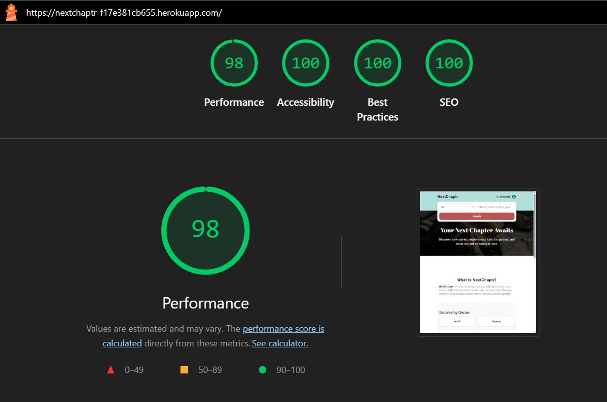
  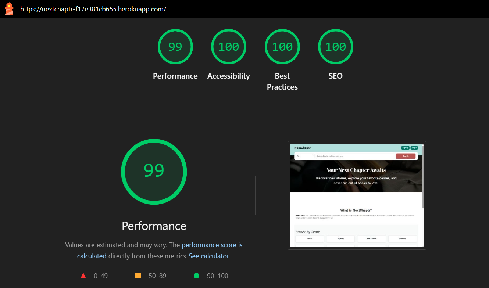
  
  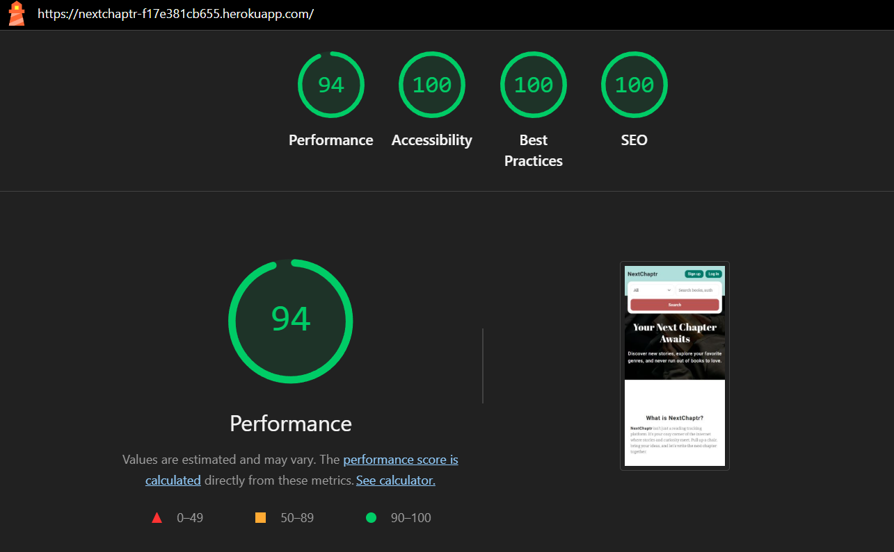
</details>

<details>

<summary>Search</summary>

  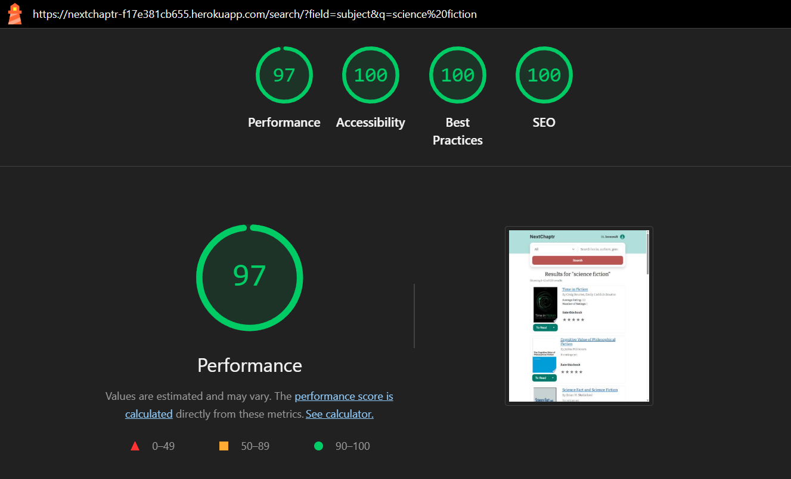
  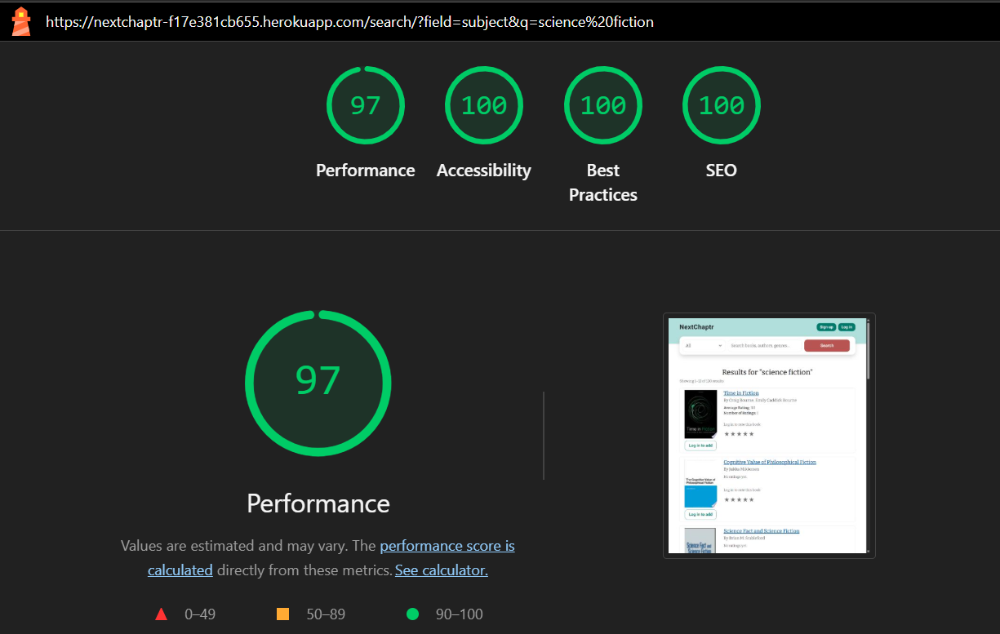
  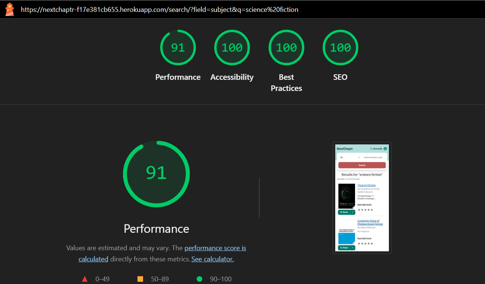
  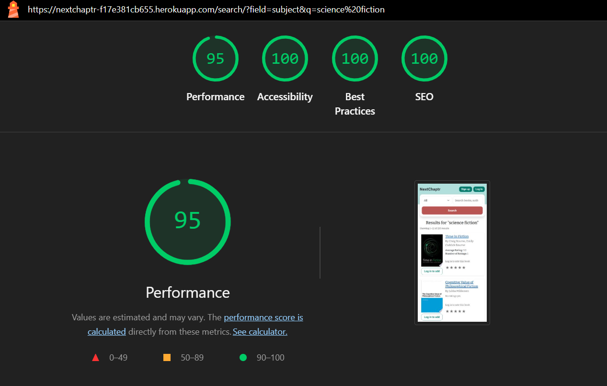
</details>

<summary>Book Page</summary>

  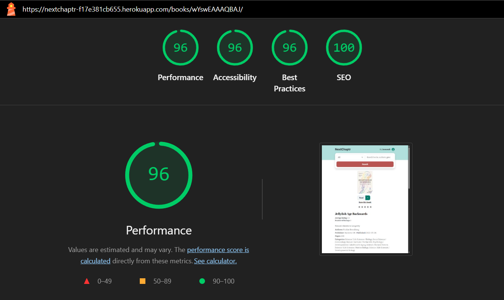
  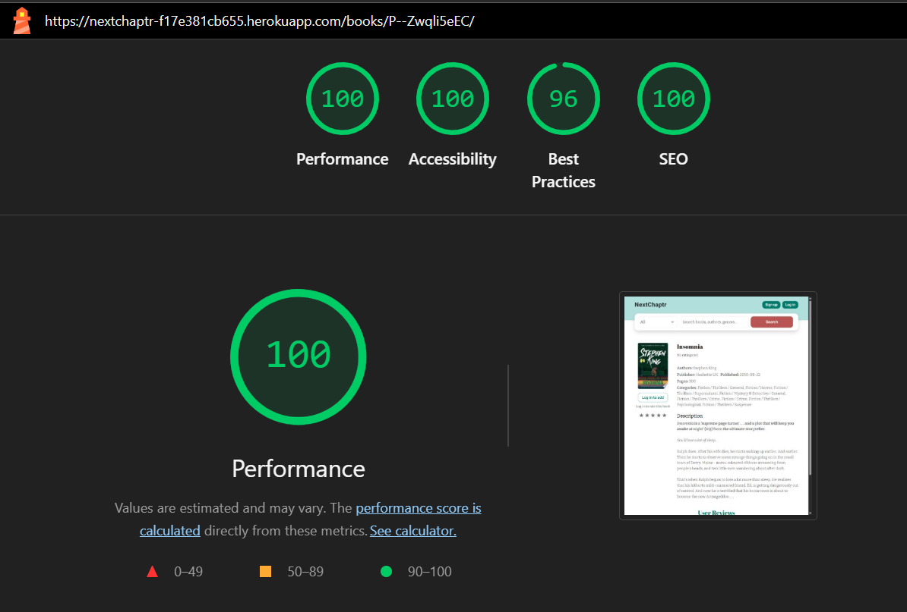
  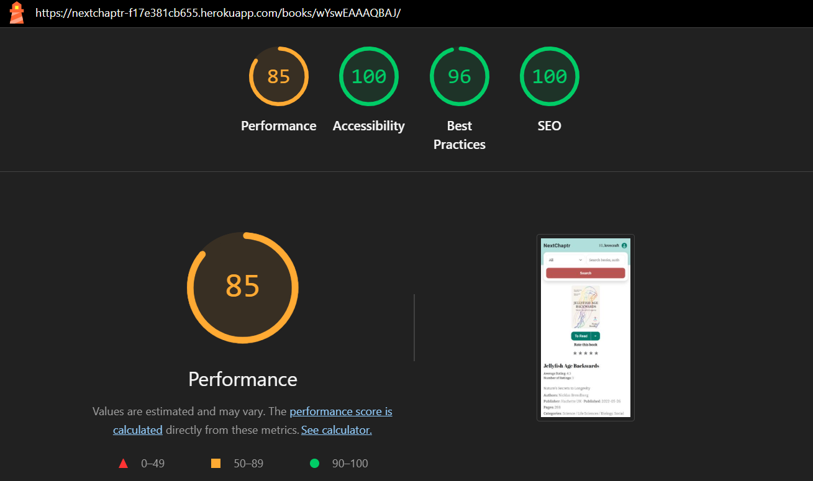
  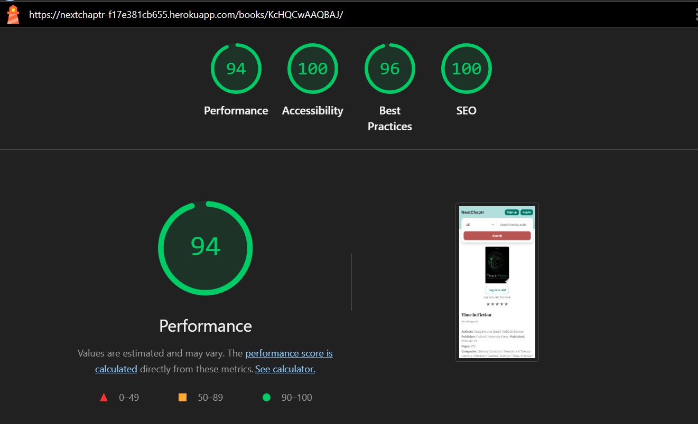
</details>

<summary>Library</summary>

  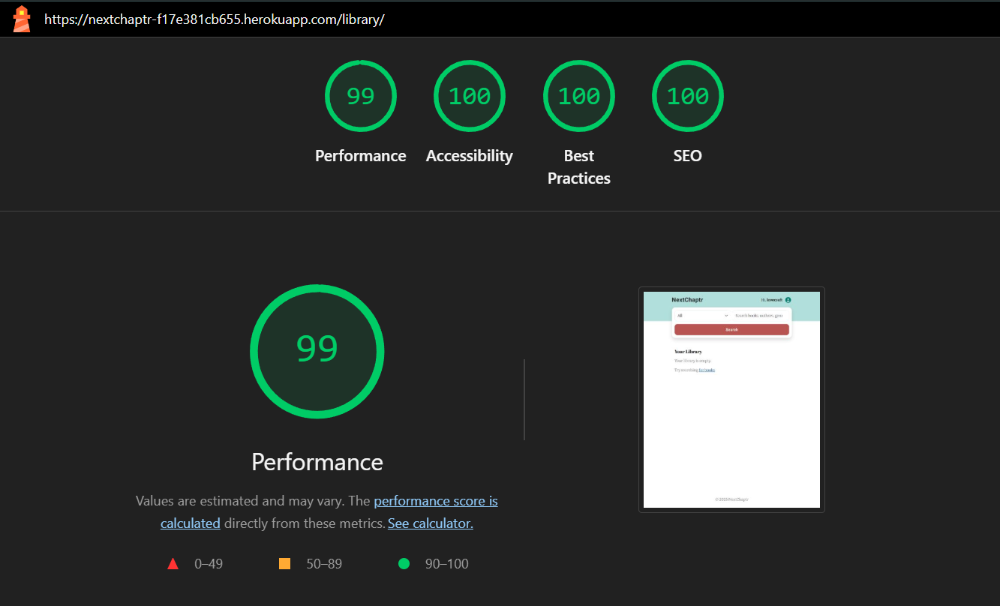
  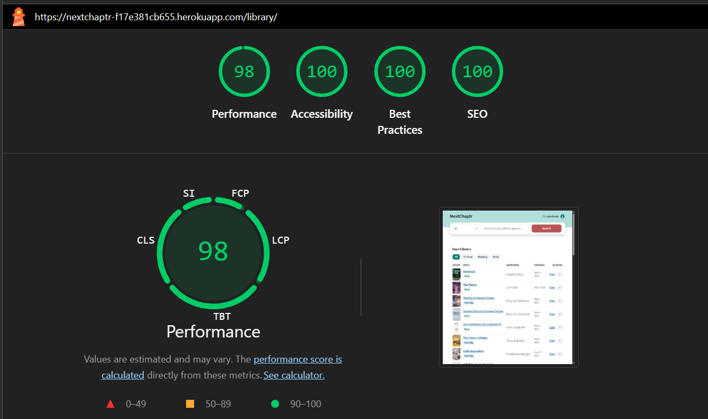
  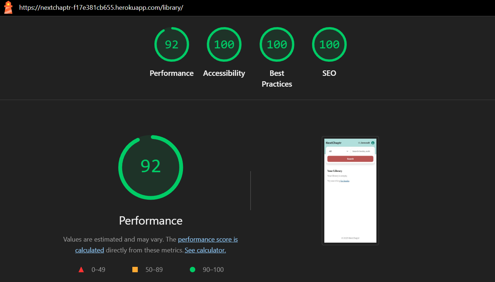
  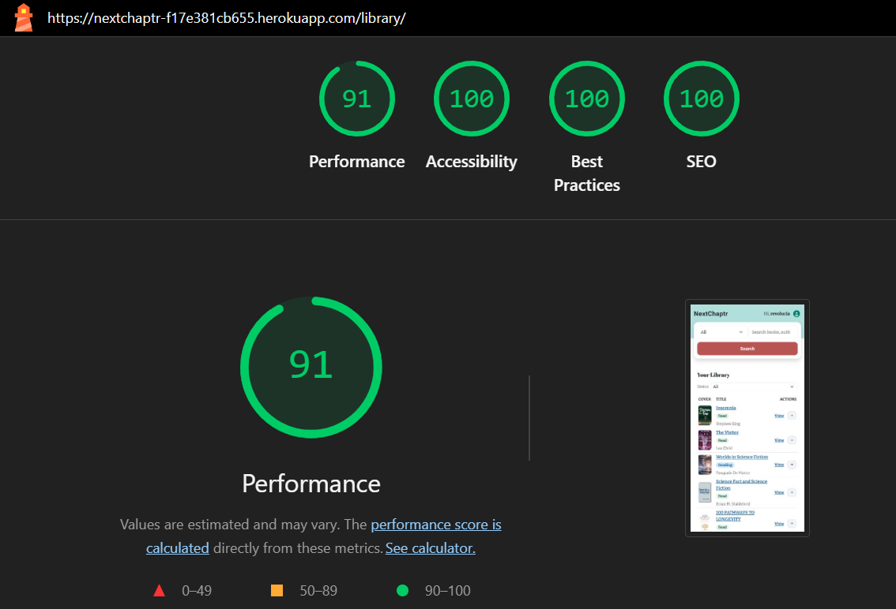
</details>

### [Pep8](https://pep8ci.herokuapp.com/#)
- All files passed PEP8 validation. Screenshots can be found at [Pep8 folder](documentation/images/validators/pep8/)

---

## Project Board

All issues are tracked on the GitHub project board:  
https://github.com/larevolucia/chaptr/projects/12

## Sprint Planning

Sprints are organized to deliver features incrementally, with each sprint focusing on specific epics and user stories. The sprint timebox is set to 1 week.

### Sprint 0: Project Setup
- [x] Create Epics, User Stories, and Tasks in GitHub
- [x] Set up Django project and apps
- [x] Configure Google Books API integration
- [x] Deploy initial version to Heroku
- [x] Set up Postgres database
- [x] Set up basic templates and static files

### Sprint Breakdown
Sprint 1:
- Epic 1: Book Discovery and Browsing
   - [x] [Search for books by title, author, genre](https://github.com/larevolucia/chaptr/issues/6)
   - [x] [View book details](https://github.com/larevolucia/chaptr/issues/7)
   - [x] [Homepage - MVP](https://github.com/larevolucia/chaptr/issues/56)

- Epic 2: User Authentication and Permissions
   - [x] [Register an account](https://github.com/larevolucia/chaptr/issues/10)
   - [x] [Log in and log out securely](https://github.com/larevolucia/chaptr/issues/11)

Sprint 2:
- Epic 1: Book Discovery and Browsing
   - [x] [Prompt login when guests try to interact](https://github.com/larevolucia/chaptr/issues/9)
   - [x] [Homepage - Stretch](https://github.com/larevolucia/chaptr/issues/56)
- Epic 2: User Authentication and Permissions
   - [x] [Restrict book interactions to authenticated users](https://github.com/larevolucia/chaptr/issues/12)
- Epic 3: Book Interaction and Reading Progress
   - [x] [Mark books as To Read, Reading, or Read](https://github.com/larevolucia/chaptr/issues/13)
   - [x] [Rate books](https://github.com/larevolucia/chaptr/issues/14)
   - [x] [Leave a review](https://github.com/larevolucia/chaptr/issues/15)

Sprint 3:
- Epic 1: Book Discovery and Browsing
   - [x] [View reviews on books](https://github.com/larevolucia/chaptr/issues/8)
- Epic 3: Book Interaction and Reading Progress
   - [x] [Edit, and delete reviews](https://github.com/larevolucia/chaptr/issues/16)
- Epic 4: User Dashboard
   - [x] [View books grouped by reading status](https://github.com/larevolucia/chaptr/issues/17)
   - [x] [Update reading status directly from dashboard](https://github.com/larevolucia/chaptr/issues/18)

Sprint 4:
- Testing and Bug Fixes
   - [x] [Refactoring](https://github.com/larevolucia/chaptr/issues/85)
   - [x] [Accessibility & Performance](https://github.com/larevolucia/chaptr/issues/87)
   - [ ] [Documentation](https://github.com/larevolucia/chaptr/issues/88)

---


## Features

### Homepage (Banner, Intro & Quick Browse)

A welcoming, responsive landing experience that introduces CHAPTR and funnels visitors into core actions.

* **Responsive Hero Banner**: A full‑width banner at the top establishes brand tone and provides instant visual context.
* **Clear Purpose Blurb**: A short, centered description directly beneath the banner explains what NextChaptr does and who it’s for.
* **Primary Actions Up Front**: Prominent entry points to start searching books or sign up/log in, keeping the first‑run path obvious.
* **Browse by Genre**: Category tiles allow users to jump straight to a filtered search view for a given genre.

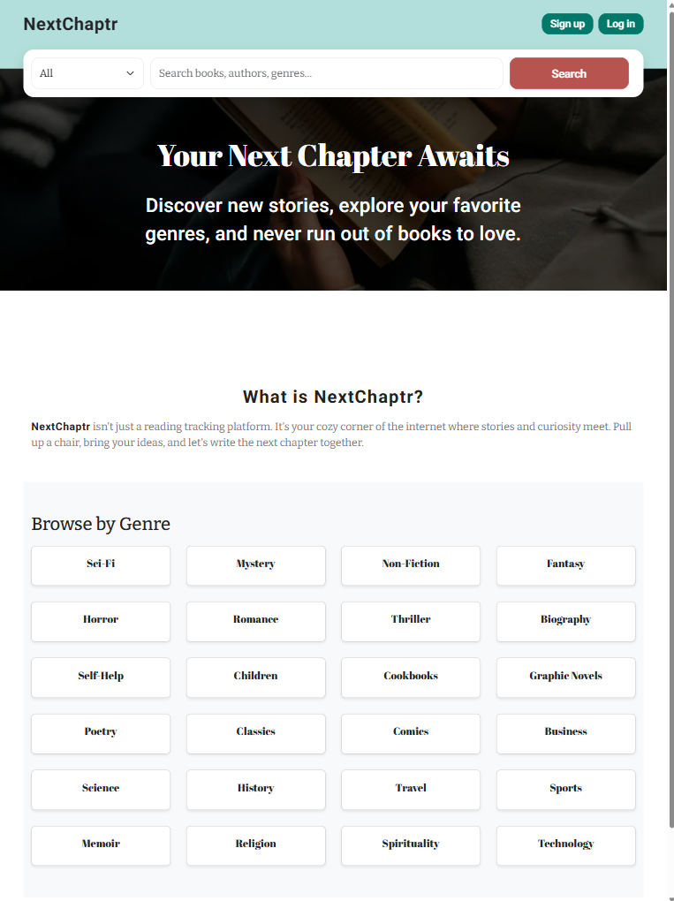


### Search & Browse (API First)

Book discovery is powered by the Google Books API, allowing users to explore a vast catalog with flexible search options.

* **Keyword or Field-Specific Search**: Search by general keywords or refine by title, author, or genre.
* **Smart Query Handling**: The system applies the correct Google Books operators automatically.
* **Clean Results**: Results display thumbnails, titles, and authors in a browsable layout.
* **First-party cover images**: The app serves covers via a small `/cover/` proxy on our own domain to avoid third-party requests/cookies and improve Lighthouse privacy scores.
* **Pagination**: Supports navigating through large result sets with ease.
* **Resilient Design**: Handles API or network errors gracefully without breaking the user experience.
* **Caching:** details are cached for \~1h to reduce API calls.
* **Searh Bar Desing:** search forms uses an always visible select element for the search query fields. Design was inspired by [booking.com](https://www.booking.com/) and [Goodreads](https://www.goodreads.com/).

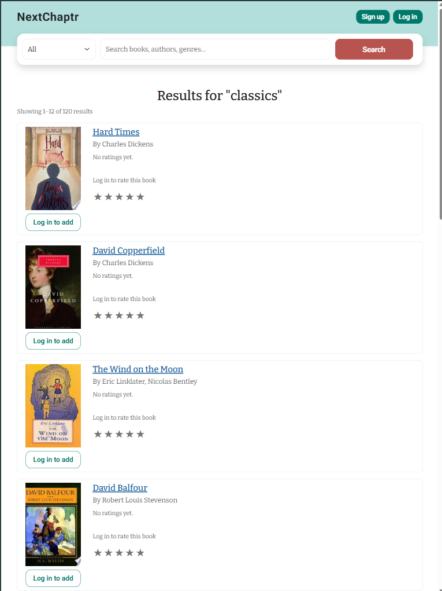

<details>
<summary>More images</summary>

  
</details>

### Book Detail View
Each book has a dedicated detail page with enriched information for readers.

* **Comprehensive Metadata**: Includes title, subtitle, authors, publisher, publication date, page count, categories, description, and cover image.
* **First-party cover images**: The app serves covers via a small `/cover/` proxy on our own domain to avoid third-party requests/cookies and improve Lighthouse privacy scores.
* **Performance Boost**: Uses Django caching to store details for one hour, reducing API calls while keeping data fresh.
* **Seamless Access**: Directly linked from search results for a smooth browsing experience
* **Page Desing**: Page design follows hierarchy used in other content hubs, such as [imdb.com](https://www.imdb.com/), [letterboxd](https://letterboxd.com/), [goodreads](https://www.goodreads.com/), [amazon](https://www.amazon.com), etc. Image is displayed at the top left corner, with basic metadata (Title, Authors) at the top of the page. CTA and Ratings are right below the cover art, while reviews (long text interaction) are at the bottom of the page

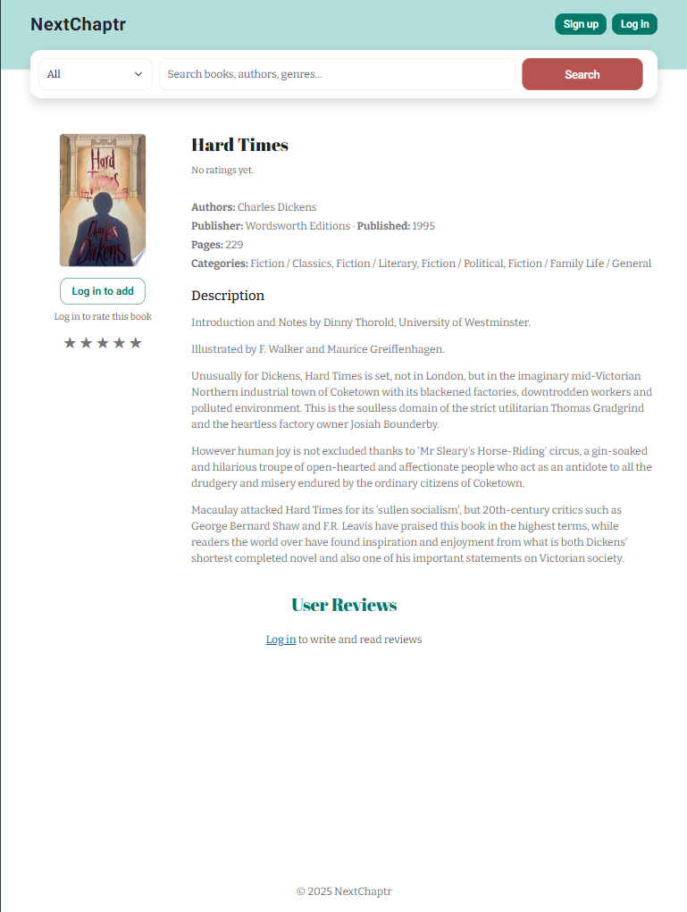


### Reading Progress (Status Updates)

Let users track where they are with any book using a simple three-state flow.

* **Three statuses**: *To read*, *Reading*, *Read* (`TO_READ`, `READING`, `READ`). One status per `(user, book)`.
* **Inline controls**: POSTing a valid status creates/updates a `ReadingStatus`; invalid choices show a friendly error and redirect back to the detail page.
* **Remove from library**: Sending `status=NONE` deletes the status and **archives** any rating/review for that book (kept for analytics, hidden from UI).
* **Book FK safety**: Status changes ensure a `Book` row exists via `fetch_or_refresh_book(...)`.
* **Integrity & performance**: Unique constraint on `(user, book)` with helpful indexes for library queries.
* **UX feedback**: Success/error messages confirm each action and return users to the originating page.
* **Button Desing**: *To read* status is a primary action as saving a book they are interested in reading later is main use case. Other status are easily accessible via dropdown. Down arrow on dropdown signals to user additional settings, making it intuitive. 


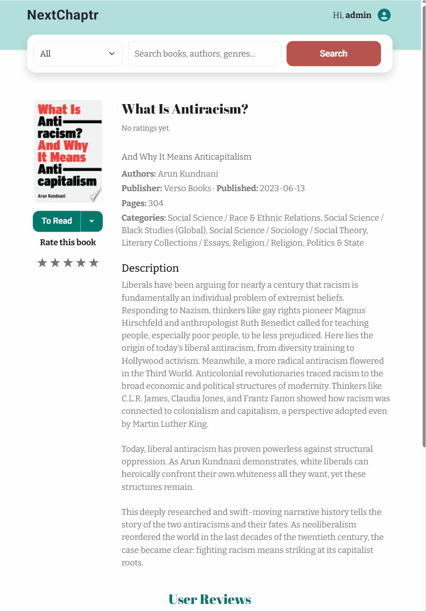

<details>
<summary>More images</summary>

  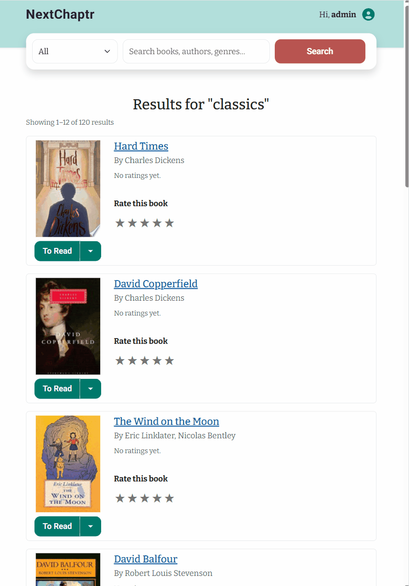
</details>


### Rating System

Provides a quick way for readers to rate books and share feedback with the community.

* **Star ratings (1–5)**: Authenticated users can create/update a rating; `rating=0` removes it. Values outside 1–5 show a validation message.
* **Status invariant**: Posting a rating ensures a `ReadingStatus` exists (defaults to **READ** if missing). Existing statuses are respected.
* **Archive on removal**: Removing a status archives the user’s rating (`is_archived=True`, timestamped) so they disappear from UI but stay available for analytics. Re-posting **unarchives** the most recent row.
* **Averages & counts**: Helpers compute average rating and total ratings for display on the book detail.
* **User Feedback**: Notifications confirm when a rating is saved or updated.
* **Flexible Control**: Ratings can be removed at any time.
* **Rating Buttons Desing:** star format and animation on hover was inpired by [letterboxd.com](https://letterboxd.com/) and [Goodreads](https://www.goodreads.com/), making intuitive for users of similar platforms.


<details>
<summary>More images</summary>

  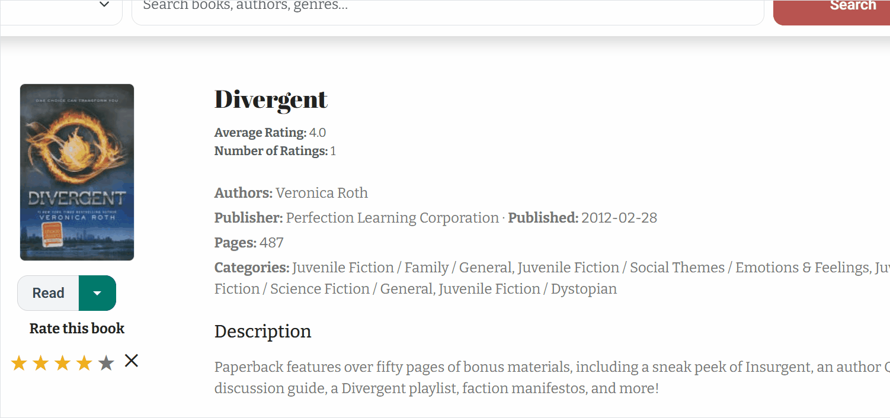
</details>


### Review System

Lets readers share longer-form thoughts on a book, with a clear, edit-friendly flow on the detail page.

* **Single, Text-Based Review**: Authenticated users can post one review per book.
* **Inline Compose, Edit & Delete**: If you haven’t reviewed, a form appears. If you have, your review shows with an *Edit* and *Delete* buttons.
* **One-Per-Book Guarantee**: A unique `(user, book)` constraint updates on re-submit (no duplicates).
* **Status Invariant**: Posting a review ensures a status row exists (defaults to **Read** if missing).
* **Archive on removal**: Removing a status archives the user’s review (`is_archived=True`, timestamped) so they disappear from UI but stay available for analytics. Re-posting **unarchives** the most recent row.
* **No duplicates**: A unique active review per `(user, book)` prevents multiple comments; reposting updates the same record.
* **Ownership guard**: Only the author can delete their comment; unauthorized deletes return `403`.

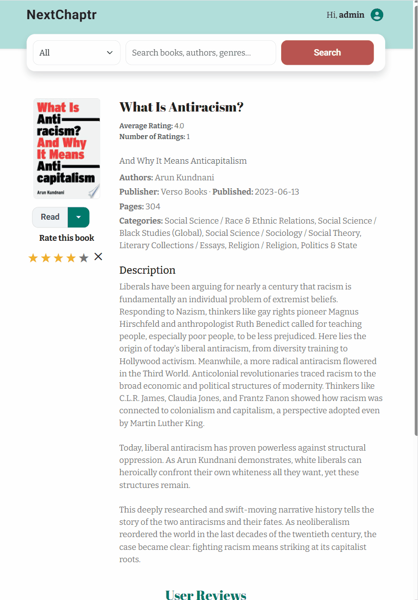

### Library

A user’s personal library displays all books they are interested in, along with their reading status.

* **Grouped by Status**: Books are organized into sections for *To Read*, *Reading*, and *Read*.
* **First-party cover images**: The app serves covers via a small `/cover/` proxy on our own domain to avoid third-party requests/cookies and improve Lighthouse privacy scores.
* **UX Note**: The “Remove from Library” action opens a confirm dialog that also tells you your rating and review for the book will be removed from your profile (they’ll be archived, not permanently deleted).
* **Dynamic Updates**: The library view updates in real-time as users change book statuses.
* **Link to Book Details**: Each book links to its detail page for more information.

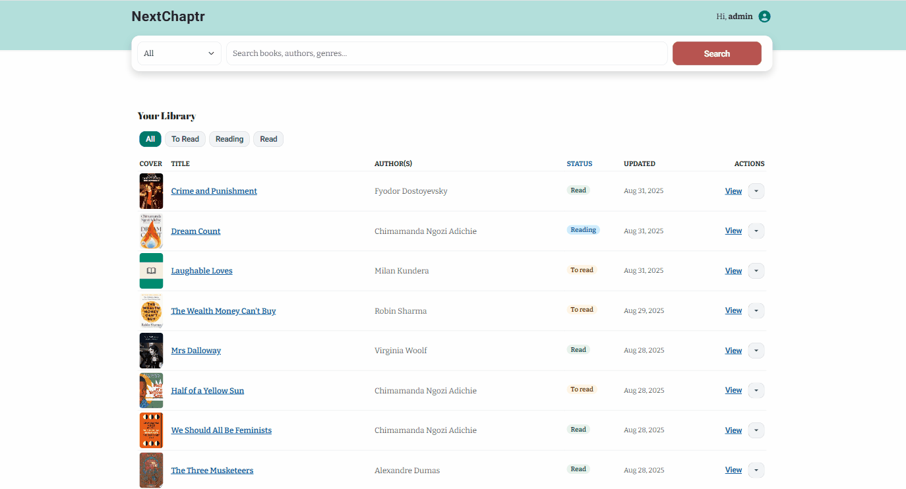

<details>
<summary>More images</summary>

  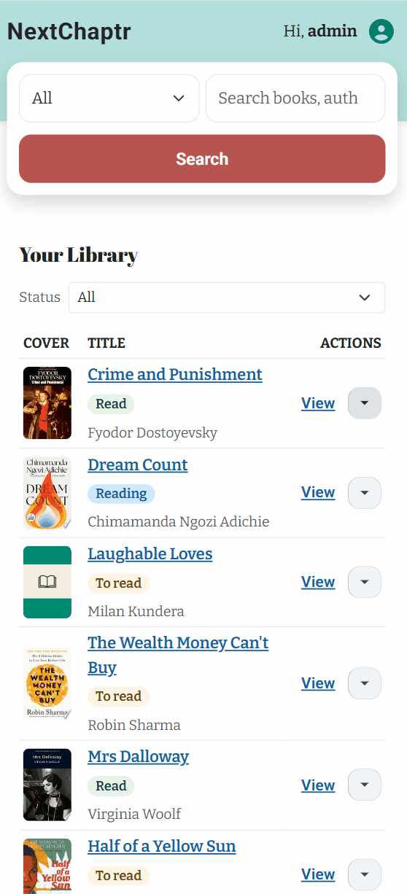

  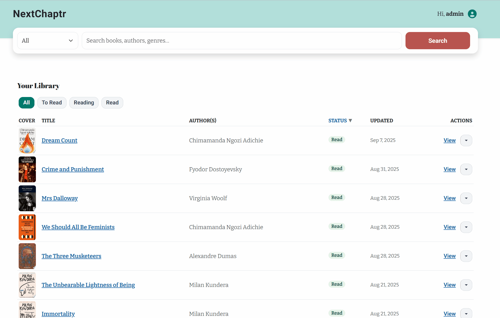

  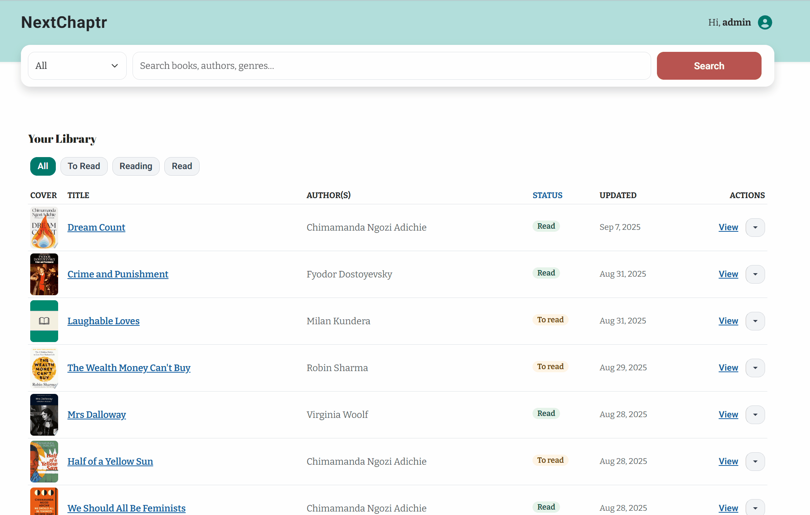
</details>


### Confirmation Modals

Critical actions, such as removing a book from the library or deleting a review, are protected by confirmation modals to prevent accidental loss of data.

* **Clear Messaging**: Modals clearly explain the consequences of the action.
* **User Control**: Users can confirm or cancel the action, ensuring they have full control over their data.
* **Reusable Component**: The modal is implemented as a reusable template partial for consistency across the site.
* **Design Rationale**: App follows UX best practices by presenting a confirmation modal to avoid accidental critical actions.

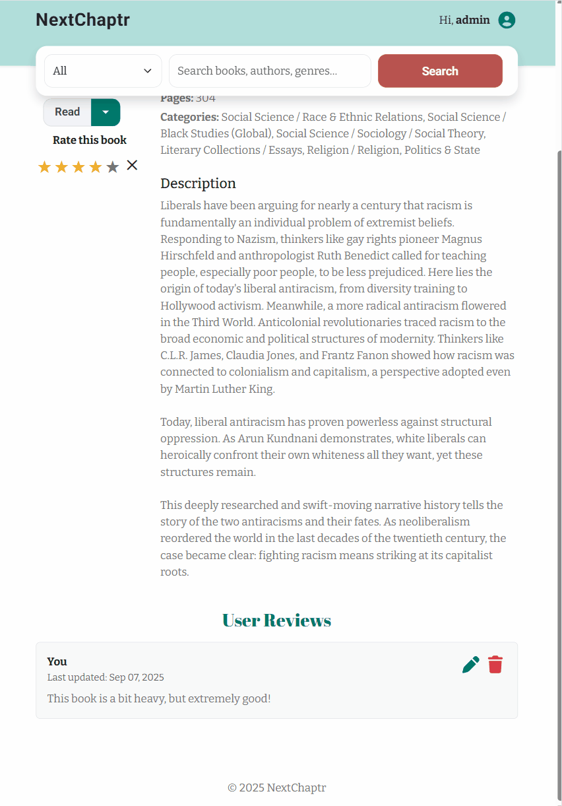

### Authentication (Login, Logout & Sign-Up)

User authentication is powered by **Django Allauth**, providing a secure and reliable way to manage accounts.

* **Sign-Up**: New users can easily create an account. The sign-up template has been customized to match the site’s brand style.
* **Login / Logout**: Users can log in to access their personal features and log out securely when finished.
* **Consistent UI**: Allauth templates have been adapted to the project’s design system, ensuring a seamless experience across authentication pages.

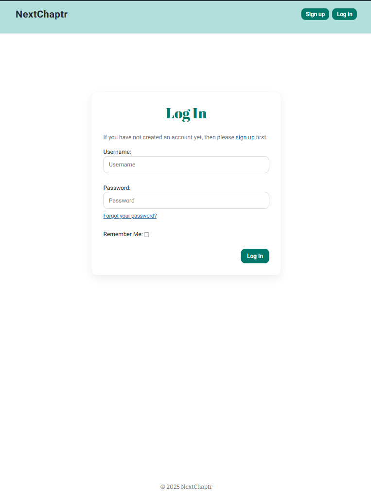
<details>
<summary>More images</summary>

  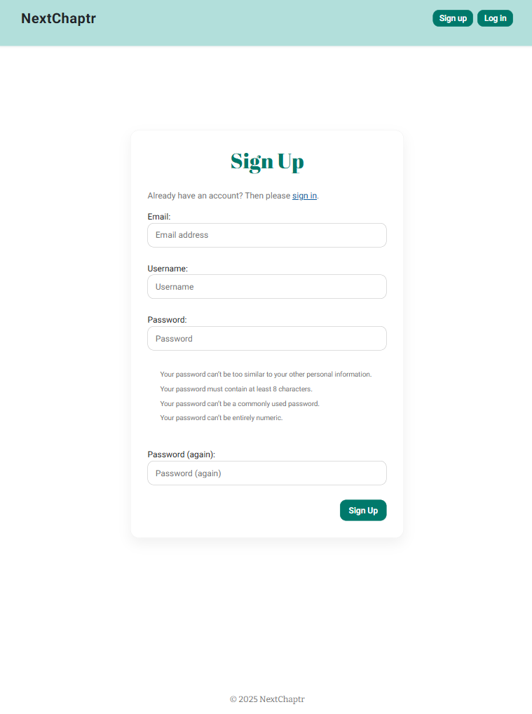
</details>

### Custom Error Pages

Custom error pages were created to keep the brand styles.

* **Error**: Page informs user the type of error.
* **Redirect**: Buttons are included for the user to go back to home or previous page.
* **Incident number**: Incident numbers are included for communication with help center.

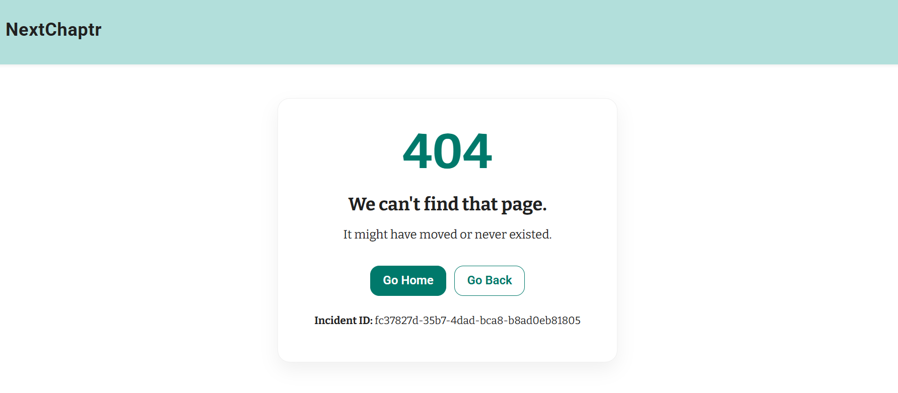


### Admin Panel

* **Books** admin shows minimal cached metadata (id, title, authors, thumb, language, published date, fetch markers).
* **Reading statuses** admin shows `(user, book_id, title, status)` with a link to the Google Books page.
* **Rating** admin lists include denormalized book titles and quick links to Google Books and support searching by user, book ID and title.
* **Review** admin lists support searching by user, book ID/title, and content, with date filters for moderation.


## Design

### Fonts

The font pairing balances readability and personality. **Bitter** ensures a comfortable reading experience, **Roboto** adds modern clarity for the interface, and **Abril Fatface** brings a touch of elegance for emphasis.

### Color Palete

The color palette draws inspiration from nature, creating a cozy atmosphere with a calming effect, much like the feeling of reading.
Green tones are used as primary color and blue as secondary. Terracota tone is used as an accent color. 

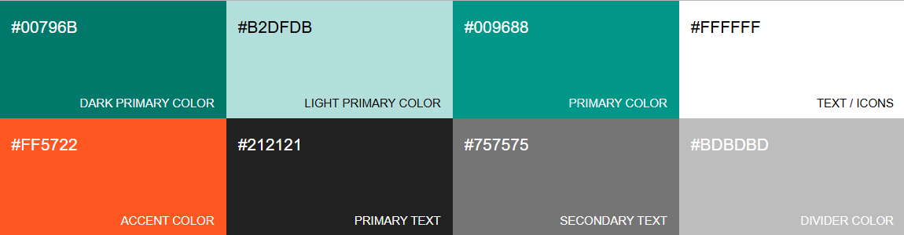

### Wireframes

As a mobile-first approach, wireframes focused on the smaller screens. Tablets and desktop design kept the same design but making better use of wider screen, particularly for tables.


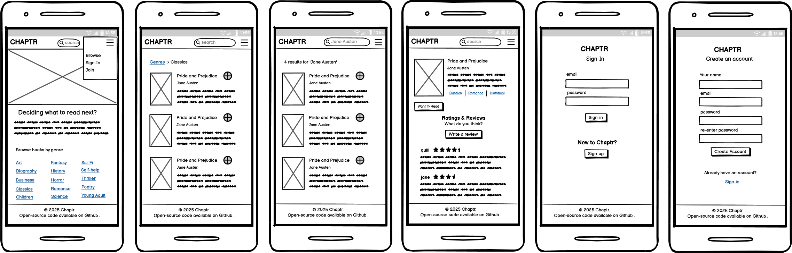

---

## Models

The data model balances **external metadata** (from Google Books) with **internal user interactions**.
Books are only stored locally if a user explicitly saves or interacts with them, keeping the database lightweight.

[!Models ERD](documentation/images/ERD/models.jpg)

### User 
Uses Django’s built-in `User` model for authentication and ownership of records.

### Book
Represents a book saved in the system (created only when a user adds it to a shelf or sets a reading status).
Primary key is the Google Books `volumeId`.

**Fields:**

* `id`: `CharField`, `PK` (Google volumeId)
* `title`: `CharField`
* `authors`: `TextField` (list of author names)
* `thumbnail_url`: `URLField`
* `language`: `CharField`
* `published_date_raw`: `CharField`
* `etag`: `CharField`
* `last_modified`: `DateTimeField` (HTTP cache header)
* `last_fetched_at`: `DateTimeField` (defaults to now)
* `created_at`: `DateTimeField` (record creation timestamp)
* `updated_at`: `DateTimeField` (auto-updated timestamp)

**Meta:**
* Index on `title` for faster search.

**Methods:**
* `needs_refresh(ttl_minutes=1440)`: checks if book metadata has expired, with a default time-to-live of 24 hours.

**Cover storage vs. display**  
* The database stores the *remote* `thumbnail_url` only; image bytes are **not** stored. 
At render time, templates use a first-party **cover proxy** to fetch and serve the image from our own origin. 
This keeps the DB lightweight and eliminates third-party cookies. 
(A future enhancement could add an `ImageField` to persist files if needed.)


### ReadingStatus
Tracks a user's reading status for a specific book.

**Fields:**

* `user`: `ForeignKey` → `User`
* `book`: `ForeignKey` → `Book`
* `status`: `CharField` with choices:
  * `"TO_READ"` → "To read"
  * `"READING"` → "Reading"
  * `"READ"` → "Read"
* `created_at`: `DateTimeField`
* `updated_at`: `DateTimeField`

**Meta:**
* Unique constraint on `(user, book)` → one status per book per user.
* Indexes on `(user, status)`, `(user, book)`, and `status`.

### Rating
Stores a user's rating for a book.

**Fields:**
* `user`: `ForeignKey` → `User`
* `book`: `ForeignKey` → `Book`
* `rating`: `PositiveSmallIntegerField` (0-5)
* `created_at`: `DateTimeField`
* `updated_at`: `DateTimeField` (auto_now=True)
* `is_archived` `BooleanField` (default `False`) — hidden from profile/UI if `True`
* `archived_at` `DateTimeField` (nullable)

**Meta:**
* Unique constraint on `(user, book)` where `is_archived=False` guarantees at most one **active** rating per user/book while allowing archived history.

 **Visibility:**
 * Archived ratings are hidden from the UI but retained for analytics.

### Review
 Represents a user's written review of a book.

 **Fields:**
 * `user` (FK): `User`
 * `book` (FK): `Book`
 * `content`: `TextField`
 * `created_at`: `DateTimeField`
 * `updated_at`: `DateTimeField` (auto_now=True)
 * `is_archived` `BooleanField` (default `False`)
 * `archived_at` `DateTimeField` (nullable)

 **Meta:** 
* Unique constraint on `(user, book)` where `is_archived=False`.

 **Visibility:**
 * Archived reviews are hidden from the UI but retained for analytics.

---

## Django Project Structure

The *NextChaptr* project is divided into focused Django applications to ensure clear separation of concerns and maintainable code architecture.

### apps/

| App Name         | Responsibility                                                                                      |
|------------------|-----------------------------------------------------------------------------------------------------|
| `accounts`       | Accounts app current only for authentication, but will hold profile in future                       |
| `books`          | Google Books search/detail, minimal cached `Book`, admin, service,cover proxy endpoint (`/cover/`)  |
| `activity`       | Per-user `ReadingStatus`, `Rating`, `Review` persistence + admin                                    |
| `library`        | Displays user-specific reading activity grouped by status.                                          |

### Image Delivery & Privacy

To avoid third-party cookies flagged by Lighthouse, cover images are served **first-party**:

- **Endpoint**: `GET /cover/?url=<encoded-remote-url>`  
- **Behavior**: Server fetches the remote image (enforces HTTPS), whitelists Google hosts, and returns the bytes with long-lived caching headers.  
- **Templates**: Use `book.cover_url` or fall back to a local placeholder.

This affects **Search Results**, **Book Detail**, and **Library** templates and the corresponding views that now compute `cover_url` for each book.


### State Changes via Services

Lifecycle rules (e.g. “rating implies a status exists”, or “removing status archives rating/review”) are implemented in a **service layer**s. This makes behavior explicit, testable, and easy to evolve.

Key functions:
* `remove_from_library(user, book_id)` — deletes the status and **archives** the user’s rating/review for that book.
* `upsert_active_rating(user, book_id, value)` — creates or **unarchives** the latest rating, ensuring a status exists.
* `upsert_active_review(user, book_id, content)` — creates or **unarchives** the latest review, ensuring a status exists.

### Design Rationale

- **Modular design**: Each app reflects a distinct domain of the system and aligns with a major feature group (search, authentication, interaction, UI).
- **Separation of concerns**: Each app encapsulates its own models, views, and templates, making it easier to manage and extend.
- **Maintainability**: Clear boundaries between apps reduce complexity and improve code readability.
- **Scalability**: Allows future extension, such as adding a social/friendship app, without disrupting the core architecture.

---

## Testing

***NextChaptr** includes a comprehensive suite of automated tests to ensure reliability and maintainability across core features. Tests are written using **Django’s TestCase** framework with mocking for external dependenciess, such as Google Books API.

Detais testings documentation can be found at [TESTS.md](documentation/TESTS.md)

[!Automated Test Results](documentation/images/validators/automated_tests.png)

### Automated Test Coverage

* **Authentication Tests (Allauth)**

  * __Sign-up flow__: page rendering, successful account creation, and validation errors (duplicate username, short passwords, mismatches).
  * __Login flow__: correct credentials, invalid credentials, and required validation checks.
  * __Logout flow__: proper behavior when logged in or out.
  * __Password reset__: form rendering and email delivery.


* **Books App Tests**

  * __Query building__: correct application of search operators (`intitle`, `inauthor`, `subject`).
  * __Search view__: integration with `search_google_books`, correct rendering of results.
  * __Google Books API integration__: parsing of valid responses, handling of failed requests.
  * __Book detail view__: correct mapping of metadata fields, 404 behavior for missing books, and caching to reduce API calls.
  * __Home page__: correct rendering of template, hero, about area, featured genres and search functionality.


* **Book Search Pagination**

  * __Page size__: `PER_PAGE = 12` drives both the Google Books query (`max_results=12`) and Django paginator.
  * __First page__: calling `?q=django&field=all&page=1` triggers `search_google_books("django", start_index=0, max_results=12)`; `page_obj.number == 1`, `start_index()==1`, `end_index()==12`.
  * __Second page__: calling `?q=python&field=all&page=2` triggers `search_google_books("python", start_index=12, max_results=12)`; `page_obj.number == 2`, `start_index()==13`, `end_index()==24` when total is 30.
  * __Template context__: view provides `page_obj`, `paginator`, `is_paginated`, and `page_range`; `paginator.count == total`, `paginator.per_page == 12`, `is_paginated` is `True`, and the rendered page’s `object_list` length equals `PER_PAGE`.

* **Genre Browsing & Search Integration**

  * __Home genre links__: home page renders subject links formatted as `/book_search?field=subject&q=<urlencoded>`, with `class="stretched-link"` and accessible `aria-label`s (e.g. Sci-Fi, Mystery).
  * __Subject filter mapping__: clicking a genre tile (e.g. “science fiction”) calls `search_google_books("subject:science fiction", start_index=0, max_results=12)` — note the `subject:` operator prefixing the query.
  * __Pagination preserves filters__: on page 2 for `subject=mystery`, the view calls `search_google_books("subject:mystery", start_index=12, max_results=12)` and renders pagination links that keep `field=subject&q=mystery` for First/Prev/Next/Last and numbered pages.
  * __Active page semantics__: current page number is rendered as an active `<span>`, ensuring proper UX semantics; other page numbers remain links that retain the subject params.

* **ReadingStatus Tests**

  * __Anonymous users see login CTA__: detail view renders a “Log in to add” prompt and links to the login page when not authenticated.
  * __Valid choices can be set__: authenticated users can set any of `"TO_READ"`, `"READING"`, or `"READ"` and the value is persisted.
  * __Creating a status__: posting a valid status while authenticated creates a `ReadingStatus` row for the `(user, book)` pair.
  * __Unauthenticated redirects__: posting without authentication redirects to the login page and does **not** create a status.
  * __Removing a status with safe `next`__: sending `status=NONE` deletes the row and safely redirects to a same‑site `next` URL (book remains).
  * __Removing a status without `next`__: falls back to redirecting to the book detail page (book remains).
  * __Unsafe `next` is ignored__: off‑site `next` URLs are rejected; redirect falls back to the detail page.

* **Rating Tests**

  * __Unauthenticated redirects__: posting a rating without logging in redirects to the login page and does **not** create a record.
  * __Creating a rating__: authenticated users can post a rating, which creates a `Rating` row and redirects to the book detail view.
  * __Updating a rating__: posting a new value overwrites the existing `Rating` (no duplicates).
  * __Removing a rating__: posting `rating=0` deletes the existing row and redirects back to the book detail page.
  * __Auto-create status__: if a user rates a book without an existing `ReadingStatus`, a new `READ` status is created.
  * __Respect existing status__: if the user already has a `ReadingStatus` (`TO_READ`, `READING`, `READ`), rating succeeds without changing it.


* **Review Tests**

  * __Creating a review__: POST to `/books/<book_id>/review/` saves and redirects; assert redirect and one new `Review` for `(user, book)`.
  * __Book detail displays reviews__: detail view lists reviews; assert content and author appear in “User Reviews”.
  * __Anonymous users see login CTA__: shows “Log in to leave a review”; assert CTA present and no `<form>`.
  * __Authenticated users see add review form__: no existing review → textarea rendered; assert form action targets `add_review`.
  * __Editing a review (no duplicates)__: second POST updates existing row; assert updated content and still exactly one `Review`.
  * __Creates READ status when missing__: Posting a review with no existing `ReadingStatus` auto-creates one with status **READ**, then redirects back to the book detail.
  * __Respects existing status__: If a `ReadingStatus` already exists (e.g. **READING**), saving/posting a review **does not** override it to READ; the original status remains unchanged.
  * __Delete ownership check__: Only the user who created a review can delete it. Delete button is not visible to others.
  * __Delete confirmation__: The book detail page renders a modal for delete confirmation, allowing the user to confirm or cancel the deletion.
  * __Delete success__: The review is removed from the database after confirmation, displaying a success message to user.

* **Archive Flow**
  * __Status Removal__: Removing a status archives the user’s rating and review (and deletes only the status).
  * __Status Persistence__: Posting a new rating/review **unarchives** the latest archived row and ensures a status exists.
  * __UI behavior__: UI ignore archived ratings; detail page, search_results and library hides archived reviews.


* **Library Tests**

   * __Viewing the library page__: Users can view their library page with all books organized by status.
   * __Empty states__: Appropriate messages are displayed when a user has no books in a particular status.
   * __Multiple statuses__: Users with books in multiple statuses see each section correctly.
   * __Book details__: Users can click on a book to view its details.
   * __Access control__: Only authenticated users can access their library; unauthenticated users are redirected to the login page.

### Autoamted Test Approach

* **Isolation**: External API calls are mocked to ensure tests run quickly and deterministically.
* **Resilience**: Cache is cleared between tests to avoid cross-test interference.
* **Realism**: Sample JSON payloads (e.g.`REALISTIC_DETAIL_JSON`) simulate real Google Books responses for reliable field mapping tests.

These tests run automatically with:

```bash
python manage.py test --settings=chaptr.settings_test
```

and provide confidence that both authentication flows and book-related features behave as expected under different conditions.


----

### Manual Testing

**Book Discovery & Search**
| Test Case	            | Input	                                          | Expected Outcome                          	          | Status |
|:----------------------|:------------------------------------------------|:------------------------------------------------------|:-------|
| Navigate Genre tile 	| Click on "Classics"	tile                        | Search `/search/?field=subject&q=classics`	          |   ✅   |
| Search by Title	      | Select "title" and type "Little Women"          | Search `/search/?field=title&q=Little+Women`	        |   ✅   |
| Search by Author     	| Select "author" and type "John Grishman	        | Search `/search/?field=author&q=John+Grisham`	        |   ✅   |
| Search by Genre	      | Select "genre" and type "political"            	| Search `/search/?field=subject&q=political`         	|   ✅   |
| General Search	      | Select "all" and type "Fellowship of the Ring"	| Search `/search/?field=all&q=Fellowship+of+the+ring`	|   ✅   |
| View Book Detail	    | Click on "The Fellowship of the Ring"         	| Page renders with basic metadata (author, description, publisher, pages, categories, pablishing date)	|   ✅   |
| Login to add book   	| Click on 'Login to add'	| Redirects to `accounts/login` with `/?next=/search` data |   ✅    |
| Login to rate book	  | Click on stars to add a rating	| Redirects to `accounts/login` with `/?next=/search/` data |   ✅    |
| Login to review book	  | Click on 'Log in' hyperlink | Redirects to `accounts/login` with `?next=/books/` data |   ✅    |


**Authentication**
| Test Case	            | Input	                                          | Expected Outcome                          	          | Status |
|:----------------------|:------------------------------------------------|:------------------------------------------------------|:-------|
| Sign-up              	| Added temp-email, username & password           | Redirect to `/accounts/confirm-email/` and receive e-mail  |   ✅   |
| Email verification    | Click on verify your e-mail link, redirect to `/accounts/confirm-email/` and click confirm       | Alert  `You have confirmed {account}`, redirects to login        |   ✅   |
| Log-in                | Enter username and password                     | Display success message and redirects to  `/library/`	        |   ✅   |
| Log-out               | Click on header icon, open menu and click on Sign-out          | Redirects to `/accounts/logout/`	        |   ✅   |
| Log-out button        | On `/accounts/logout` click on `sign out` button               | Successfully signs out and alert user    |   ✅   |


**Library**
| Test Case	            | Input	                                          | Expected Outcome                          	          | Status |
|:----------------------|:------------------------------------------------|:------------------------------------------------------|:-------|
| First Log-in        	| Enter username and password                     | Redirects to  `/library/` and show empty library message |   ✅   |
| Sort Titles        	  | On a library with multiple books with various status, click on the Status header                     | Reorganizes the book by status (desc: to-read/reading/read ) |   ✅   |
| Filter Titles        	| On a library with multiple books with various status, click "Read" filter                      | Shows only books with status "Read". |   ✅   |
| Change Status        	| On Library, navigate to a book with status "To Read", click on arrow down next to "view"> Change Status > Select "Reading"  | Updates status and send a confirmation to user |   ✅   |
| Review Book         	| On Library, navigate to a book, click on arrow down next to "view"> Write a Review                     | Redirects to  book page #reviews |   ✅   |
| Rate Book           	| On Library, navigate to a book, click on arrow down next to "view"> Rate                     | Redirects to  book page |   ✅   |
| Remove Book         	|  On Library, navigate to a book, click on arrow down next to "view"> Change Status > Remove from Library                     | Confirmation modal is shown with correct content |   ✅   |


**Review**
| Test Case	            | Input	                                          | Expected Outcome                          	          | Status |
|:----------------------|:------------------------------------------------|:------------------------------------------------------|:-------|
| Review Form  | Search "title:jellyfish age backwards" and navigate to first item  `/books/wYswEAAAQBAJ/`	| Sees reviews and form.	|   ✅   |
| Leave Review (no status)| At Details from Jellyfish age backwards `/books/wYswEAAAQBAJ/` write and submit review "awesome"	| Pages updates, alert is sent and status is READ.	|   ✅   |
| Edit Review  | At Details from Jellyfish age backwards `/books/wYswEAAAQBAJ/` click on edit button, write "not so awesome" and save	| Review is updated, alert is sent	|   ✅   |
| Delete Review  | At Details from Jellyfish age backwards `/books/wYswEAAAQBAJ/` click on delete button	| Confirmation modal is shown	with correct messaging |   ✅   |
| Cancel Delete Confirmation  | Click on 'Cancel' | Review is not deleted 	|   ✅   |
| Confirm Delete   | Click on 'Yes, proceed' | Review is deleted and success alert is sent. |   ✅   |

**Rating**
| Test Case	            | Input	                                          | Expected Outcome                          	          | Status |
|:----------------------|:------------------------------------------------|:------------------------------------------------------|:-------|
| See Rating Avg  | Search "title:jellyfish age backwards" and navigate to first item  `/books/wYswEAAAQBAJ/`	| Rating Average displayed	|   ✅   |
| Rate Book  | At Details from Jellyfish age backwards `/books/wYswEAAAQBAJ/`, click on starts to give rating	(4) | Avg rating, number of ratings updates. Starts change to yellow according to rating. Success alert sent.	|   ✅   |
| Update Rating  | At Details from Jellyfish age backwards `/books/wYswEAAAQBAJ/`, give a different rating (3)	| Avg rating updates, number of ratings remains the same. Starts change to yellow according to rating. Success alert sent.	|   ✅   |
| Delete Rating  | At Details from Jellyfish age backwards `/books/wYswEAAAQBAJ/`, click on the x button	| Avg rating updates, number of ratings updates. Starts change gray-out version. Info alert sent.	|   ✅   |

**Status Update**
| Test Case	                   | Input	                                  | Expected Outcome                          	          | Status |
|:-----------------------------|:------------------------------------------------|:------------------------------------------------------|:-------|
| Set Status on Search         | Search "old man and the see, click on "To Read" button on result item      | Status updated, success alert sent.                          	          |   ✅   |
| Change Status on Search      | On previous item, change from "To Read" to "Reading"      | Status updated, success alert sent.                          	          |   ✅   |
| Remove Status on Search      | On previous item, remove from library         | Confirmation modal is shown with correct content  |   ✅   |
| Cancel Status Removal        | On confirmation modal, click on 'Cancel'      | Item maintain their status  |   ✅   |
| Confirm Status Removal       | On confirmation modal, click on 'Yes, proceed'          | Confirmation modal closes and status is cleared   |   ✅   |


## Deployment

### 1. Clone the Repository

Clone the project locally:

```bash
git clone https://github.com/larevolucia/chaptr.git
cd chaptr
```

Verify your Python version:

```bash
python3 --version
```

> **Note:** This project requires Python 3.12+  (check `.python-version`).

---

### 2. Set Up a Virtual Environment

It’s recommended to use a virtual environment:

```bash
python3 -m venv venv
# Activate:
# Windows
venv\Scripts\activate
# macOS/Linux
source venv/bin/activate
```

---

### 3. Install Dependencies

Install project requirements:

```bash
pip install -r requirements.txt
```

---

### 4. Configure Environment Variables

Create a `.env` file in the project root with the following variables:

#### Google Books API

The app integrates with the **Google Books API**.

1. Go to [Google Cloud Console](https://console.cloud.google.com/).
2. Create a new project ([guide](https://developers.google.com/workspace/guides/create-project)).
3. Enable the **Google Books API** (`APIs & Services > Library`).
4. Generate an **API Key** (`APIs & Services > Credentials`).

Add the key and URLs to `.env`:

```bash
GOOGLE_BOOKS_API_KEY=<YOUR_KEY>
GOOGLE_BOOKS_SEARCH_URL=https://www.googleapis.com/books/v1/volumes
GOOGLE_BOOKS_VOLUME_URL=https://www.googleapis.com/books/v1/volumes/{}
```

#### Django Secrets

Also include your Django secrets:

```bash
SECRET_KEY=<YOUR_DJANGO_SECRET_KEY>
DATABASE_URL=<YOUR_DATABASE_URL>
```

#### Email Settings (Optional)

For local testing you can disable email confirmation by editing `settings.py`:

```python
ACCOUNT_EMAIL_VERIFICATION = "none"
```

For production email (example with Gmail App Password):

```bash
EMAIL_BACKEND=django.core.mail.backends.smtp.EmailBackend
EMAIL_HOST=smtp.gmail.com
EMAIL_PORT=587
EMAIL_USE_TLS=True
EMAIL_HOST_USER=<YOUR_EMAIL_ADDRESS>
EMAIL_HOST_PASSWORD=<YOUR_APP_PASSWORD>
DEFAULT_FROM_EMAIL=<YOUR_EMAIL_ADDRESS>
```

---

### 5. Collect Static Files

Before deploying, make sure static files are collected (using [WhiteNoise](https://whitenoise.readthedocs.io/)):

```bash
python manage.py collectstatic --noinput
```

---

### 6. Deploy to Heroku

1. Create a new Heroku app
2. Add the **Heroku Python buildpack** under **Settings > Buildpacks**.
3. Add environment variables from `.env` to **Heroku Config Vars**:
4. Deploy

---

That’s it! The app should now be live on Heroku.

---

## Credits & References

- Homepage banner image: [Unsplash](https://unsplash.com/photos/iyKVGRu79G4) Photo by [Lilly Rum](https://unsplash.com/@rumandraisin?utm_content=creditCopyText&utm_medium=referral&utm_source=unsplash)
- Google Books API: [Google Developers](https://developers.google.com/books/docs/v1/getting_started)
- Color palette: [Material Palette](https://www.materialpalette.com/teal/deep-orange)
- Favicon: [Favicon.io](https://favicon.io/favicon-converter/)
- Favicon art by [Good Ware](https://www.flaticon.com/authors/good-ware)
- ChatGPT: [OpenAI](https://openai.com/chatgpt) for documentation improvement
- Copilot: [GitHub Copilot](https://github.com/features/copilot) for code completion and docstring generation
- Django Allauth: [Django Allauth](https://django-allauth.readthedocs.io/en/latest/)
- Conditional Requests: [MDN Web Docs](https://developer.mozilla.org/en-US/docs/Web/HTTP/Guides/Conditional_requests)
- Session Objects: [Requests Documentation](https://requests.readthedocs.io/en/latest/user/advanced/#conditional-requests)
- Third-party Cookies: [Privacy Sandbox](https://privacysandbox.google.com/cookies/prepare/audit-cookies)
- Custom error handling [StackOverflow](https://stackoverflow.com/questions/40758711/how-to-set-a-default-handler-for-csrf-verification-failed-in-django)
