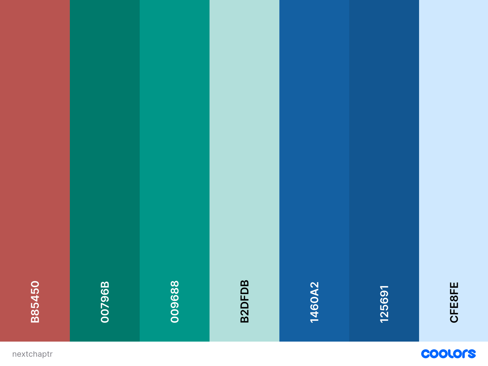
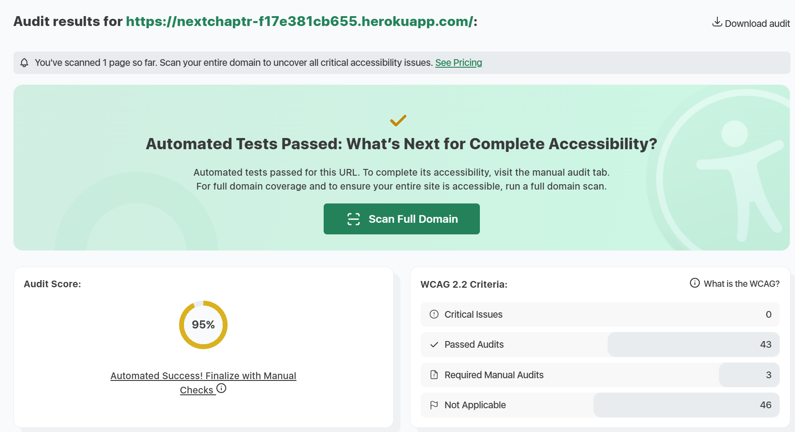
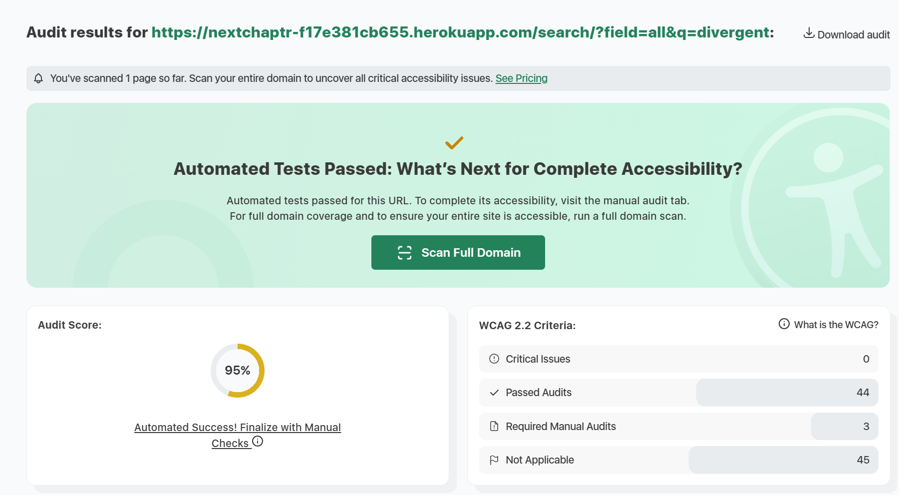
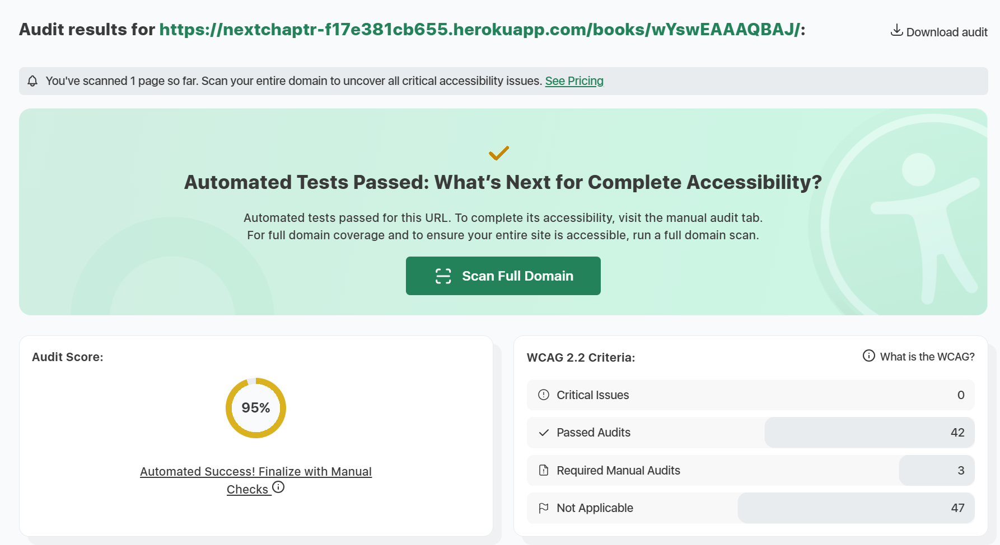
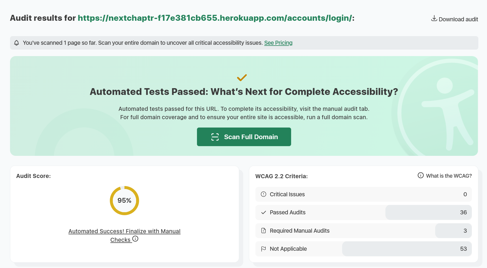
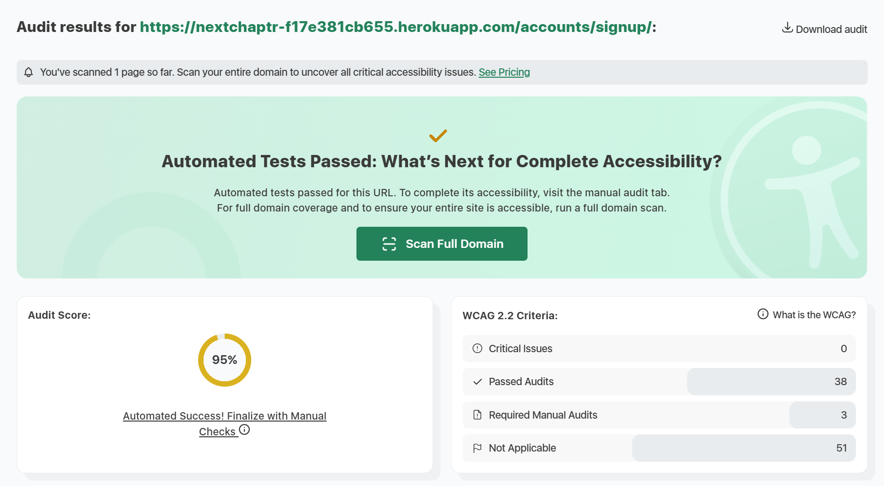

# NextChaptr

**NextChaptr** is a minimalist book-tracking web app that helps readers organize and reflect on their reading journey. Developed as a full-stack project, it highlights key features such as book categorization, rating, and reviewing with modern web technologies.

Unlike feature-heavy platforms, NextChaptr focuses on simplicity, allowing users to manage reading lists (*To Read*, *Reading*, *Read*), rate completed books, and engage through reviews in a clean, distraction-free interface.

🔗 **Live App**: [https://nextchaptr-f17e381cb655.herokuapp.com/](https://nextchaptr-f17e381cb655.herokuapp.com/)

---

## Table of Contents

- [Target Audience](#target-audience)
- [Site Goal](#site-goal)
- [Features](#features)
- [Design](#design)
- [Models](#models)
- [Django Project Structure](#django-project-structure)
- [Requirements Overview](#requirements-overview)
- [Testing](#testing)
- [Bug Fixes](#bug-fixes)
- [Sprint Planning](#sprint-planning)
- [Deployment](#deployment)
- [Credits & References](#credits--references)
- [Acknoledgements](#acknoledgements)

---

## Target Audience

NextChaptr is built for readers who want a focused, user-friendly space to log their reading habits without social clutter or unnecessary complexity.

- **Avid Individual Readers**: book enthusiasts seeking a simple, streamlined platform to log their reading journey.
- **Personal Growth & Self-Reflection Users**: individuals who track reading patterns for insights into interests, habits, and achievements.
- **Busy Readers & Lifelong Learners**: people looking to organize reading lists, track progress effortlessly, and fit reading into daily routines.

---

## Site Goal

**Promote Literacy**

- Provide a simple, engaging platform that motivates users to read more consistently.
- Support users in building sustainable reading habits through progress tracking.

**Promote Culture & Community**

- Highlight the cultural value of reading as both a personal and shared experience.
- Encourage conversations around books, authors, and ideas to foster community.

**Support Reading Management in Busy Routines**

- Help users organize their reading lists and track progress at a glance.
- Offer a lightweight, distraction-free space to balance reading with daily responsibilities.

---

## Features

### Homepage (Banner, Intro & Quick Browse)

A welcoming, responsive landing experience that introduces NextChaptr and funnels visitors into core actions.

- **Responsive hero banner**: A full-width banner sets the brand tone and provides visual context.
- **Clear purpose blurb**: A brief description explains what NextChaptr does and who it’s for.
- **Primary actions up front**: Prominent entry points to search books or sign up/log in.
- **Browse by genre**: Category tiles link directly to filtered search views.


### Search & Browse (API First)

Book discovery is powered by the Google Books API, allowing users to explore a vast catalog with flexible search options.

- **Keyword or field-specific search**: Search by general keywords or refine by title, author, or genre.
- **Smart query handling**: Automatically applies the correct Google Books operators.
- **Clean results**: Thumbnails, titles, and authors in a browsable layout.
- **First-party cover images**: A `/cover/` proxy serves covers from our own domain to avoid third-party requests/cookies and improve Lighthouse privacy scores.
- **Pagination**: Navigate large result sets with ease.
- **Resilient design**: Handles API/network errors gracefully.
- **Caching**: Details are cached for ~1 hour to reduce API calls.
- **Search bar design**: The search form uses a visible select element for query fields. Design inspired by [Booking.com](https://www.booking.com/) and [Goodreads](https://www.goodreads.com/).


<details>
<summary>More images</summary>


</details>

### Book Detail View

Each book has a dedicated detail page with enriched information for readers.

- **Comprehensive metadata**: Title, subtitle, authors, publisher, publication date, page count, categories, description, and cover image.
- **First-party cover images**: Served via the `/cover/` proxy to avoid third-party cookies.
- **Performance boost**: Uses Django caching to store details for one hour, reducing API calls while keeping data fresh.
- **Seamless access**: Linked directly from search results for a smooth browsing experience.
- **Page design**: Follows common hierarchies used in other content hubs (e.g., IMDb, Letterboxd, Goodreads, Amazon). The image appears in the top-left, core metadata at the top, primary actions and ratings below the cover, and longer-form reviews lower on the page.


### Reading Progress (Status Updates)

Track progress with a simple three-state flow.

- **Three statuses**: *To Read*, *Reading*, *Read* (`TO_READ`, `READING`, `READ`). One status per `(user, book)`.
- **Inline controls**: Posting a valid status creates/updates a `ReadingStatus`; invalid choices show a friendly error and redirect back to the detail page.
- **Remove from library**: Sending `status=NONE` deletes the status and **archives** any rating/review for that book (kept for analytics, hidden from UI).
- **Book FK safety**: Status changes ensure a `Book` row exists via `fetch_or_refresh_book(...)`.
- **Integrity & performance**: Unique constraint on `(user, book)` with helpful indexes for library queries.
- **UX feedback**: Success/error messages confirm actions and return users to the originating page.
- **Button design**: *To Read* is emphasized as the primary action (a common first step). Other statuses are accessible via a dropdown (the arrow hints at additional options).


### Rating System

Provide quick feedback and aggregate community sentiment.

- **Star ratings (1–5)**: Authenticated users can create/update a rating; `rating=0` removes it. Values outside 1–5 display a validation message.
- **Status invariant**: Posting a rating ensures a `ReadingStatus` exists (defaults to **READ** if missing). Existing statuses are respected.
- **Archive on removal**: Removing a status archives the user’s rating (`is_archived=True`, timestamped) so it disappears from UI but remains for analytics. Re-posting unarchives the most recent row.
- **Averages & counts**: Helpers compute average rating and total ratings for display on the book detail.
- **User feedback**: Notifications confirm when a rating is saved or updated.
- **Rating buttons design**: The star format and hover animation are inspired by Letterboxd and Goodreads for familiarity.


<details>
<summary>More images</summary>


</details>

### Review System

Let readers share longer-form thoughts with an edit-friendly flow.

- **Single, text-based review**: One review per user/book.
- **Inline compose, edit & delete**: No review → a form appears. With a review → *Edit* and *Delete* buttons.
- **One-per-book guarantee**: A unique `(user, book)` constraint updates on resubmission (no duplicates).
- **Status invariant**: Posting a review ensures a status row exists (defaults to **READ** if missing).
- **Archive on removal**: Removing a status archives the user’s review (`is_archived=True`, timestamped). Re-posting unarchives the most recent row.
- **Ownership guard**: Only the author can delete their review; unauthorized deletes return `403`.


### Library

A personal library displays all books a user is interested in, with their respective reading status.

- **Filter by status**: Filter tags at the top of the table allows user to filter by status: *All* (default), *To Read*, *Reading*, and *Read*.
- **Sorting**:  Table default sorting is by updated timestamp. Optional sorting by **Status (asc/desc)** available by clicking on column header.
- **First-party cover images**: Served via `/cover/` to avoid third-party cookies.
- **UX note**: “Remove from Library” opens a confirmation dialog that explains rating/review will be removed from the profile (archived, not permanently deleted).
- **Dynamic updates**: The library view reflects changes immediately.
- **Links to details**: Each book links to its detail page.


<details>
<summary>More images</summary>


</details>

### Confirmation Modals

Critical actions (e.g., removing a book from the library or deleting a review) are protected by confirmation modals.

- **Clear messaging**: Modals explain consequences.
- **User control**: Confirm or cancel to retain control.
- **Reusable component**: Implemented as a template partial for consistency.
- **Design rationale**: Follows UX best practices to prevent accidental destructive actions.


### Authentication (Login, Logout & Sign Up)

User authentication is powered by **Django Allauth** for a secure and reliable account experience.

- **Sign up**: New users can create an account. The template is customized to match the site’s brand.
- **Login / Logout**: Access personal features and log out securely.
- **Consistent UI**: Allauth templates are adapted to the project’s design system.
- **Actions require authentication**: While browsing and discovery is allowed to all, only authenticated users can add a book to their library, rate or review books. 


  > **Permissions Matrix**
  >
  > | Action         | Guest | Authenticated |
  > | -------------- | ----- | ------------- |
  > | Add to Library | ✖     | ✔             |
  > | Change  Status | ✖     | ✔             |
  > | Rate Book      | ✖     | ✔             |
  > | Write Review   | ✖     | ✔             |
  > | Delete Review  | ✖     | ✔ (own only)  |


<details>
<summary>More images</summary>


</details>

### Custom Error Pages

Custom error pages maintain brand styling.

- **Clear error**: Pages state the error type.
- **Redirects**: Buttons return users to home or the previous page.
- **Incident number**: Included for help-center communication.


### Admin Panel

- **Books** admin shows minimal cached metadata (id, title, authors, thumbnail, language, published date, fetch markers).
- **Reading statuses** admin shows `(user, book_id, title, status)` with a link to the Google Books page.
- **Rating** admin lists denormalized book titles with quick links to Google Books; supports searching by user, book ID, and title.
- **Review** admin lists support searching by user, book ID/title, and content, with date filters for moderation.

---

## Design

### Fonts

The pairing balances readability and personality. **Bitter** ensures a comfortable reading experience, **Roboto** adds modern clarity for interface text, and **Abril Fatface** adds emphasis.

### Color Palette

The palette draws inspiration from nature for a cozy, calming atmosphere, akin to the feeling of reading.
Green is the primary color, blue the secondary, and terracotta serves as an accent.



### Accessibility & WCAG Compliance

Accessibility has been verified with W3C, Lighthouse, Accessibility Checker and manual checks:

- **Color contrast**: Verified against WCAG 2.1 AA using [Accessibility Checker](documentation/images/validators/accessibility_checker/) and [Lighthouse](documentation/images/validators/lighthouse/)
- **Keyboard navigation**: All interactive elements are reachable in a logical order; skip links added to jump to main content.
- **ARIA roles**: Removed redundant roles flagged by W3C validator; only essential ARIA attributes remain.
- **Error feedback**: Forms and destructive actions provide clear feedback and confirmations.


### Wireframes

Following a mobile-first approach, wireframes focus on smaller screens. Tablet and desktop designs use the same layout principles while making better use of wider screens, particularly for tables.


---

## Models

The data model balances **external metadata** (from Google Books) with **internal user interactions**.  
Books are only stored locally if a user explicitly saves or interacts with them, keeping the database lightweight.


### User

Uses Django’s built-in `User` model for authentication and ownership of records.

### Book

Represents a book saved in the system (created only when a user sets a reading status, rates or reviews it).  
The primary key is the Google Books `volumeId`.

**Fields**

- `id`: `CharField`, PK (Google `volumeId`)
- `title`: `CharField`
- `authors`: `TextField` (list of author names)
- `thumbnail_url`: `URLField`
- `language`: `CharField`
- `published_date_raw`: `CharField`
- `etag`: `CharField`
- `last_modified`: `DateTimeField` (HTTP cache header)
- `last_fetched_at`: `DateTimeField` (defaults to now)
- `created_at`: `DateTimeField` (record creation timestamp)
- `updated_at`: `DateTimeField` (auto-updated)

**Meta**

- Index on `title` for faster search.

**Methods**

- `needs_refresh(ttl_minutes=1440)`: checks if book metadata has expired (default TTL: 24 hours).

**Cover storage vs. display**  
The database stores the *remote* `thumbnail_url` only; image bytes are **not** stored.  
At render time, templates use a first-party **cover proxy** to fetch and serve the image from our origin.  
This keeps the DB lightweight and eliminates third-party cookies.  
(A future enhancement could add an `ImageField` to persist files if needed.)

### ReadingStatus

Tracks a user's reading status for a specific book.

**Fields**

- `user`: `ForeignKey` → `User`
- `book`: `ForeignKey` → `Book`
- `status`: `CharField` with choices:
  - `"TO_READ"` → “To Read”
  - `"READING"` → “Reading”
  - `"READ"` → “Read”
- `created_at`: `DateTimeField`
- `updated_at`: `DateTimeField`

**Meta**

- Unique constraint on `(user, book)` → one status per book per user.
- Indexes on `(user, status)`, `(user, book)`, and `status`.

### Rating

Stores a user's rating for a book.

**Fields**

- `user`: `ForeignKey` → `User`
- `book`: `ForeignKey` → `Book`
- `rating`: `PositiveSmallIntegerField` (0–5)
- `created_at`: `DateTimeField`
- `updated_at`: `DateTimeField` (auto_now=True)
- `is_archived`: `BooleanField` (default `False`) — hidden from profile/UI if `True`
- `archived_at`: `DateTimeField` (nullable)

**Meta**

- Unique constraint on `(user, book)` where `is_archived=False` guarantees at most one **active** rating per user/book while allowing archived history.

**Visibility**

- Archived ratings are hidden from the UI but retained for analytics.

### Review

Represents a user's written review of a book.

**Fields**

- `user` (FK): `User`
- `book` (FK): `Book`
- `content`: `TextField`
- `created_at`: `DateTimeField`
- `updated_at`: `DateTimeField` (auto_now=True)
- `is_archived`: `BooleanField` (default `False`)
- `archived_at`: `DateTimeField` (nullable)

**Meta**

- Unique constraint on `(user, book)` where `is_archived=False`.

**Visibility**

- Archived reviews are hidden from the UI but retained for analytics.

---

## Django Project Structure

The *NextChaptr* project is divided into focused Django applications to ensure clear separation of concerns and maintainable architecture.

### apps/

| App Name   | Responsibility                                                                                          |
|------------|---------------------------------------------------------------------------------------------------------|
| `accounts` | Authentication for now; will hold profile features in the future                                        |
| `books`    | Google Books search/detail, minimal cached `Book`, admin, services, cover proxy endpoint (`/cover/`)    |
| `activity` | Per-user `ReadingStatus`, `Rating`, `Review` persistence + admin                                        |
| `library`  | Displays user-specific reading activity with status information                                         |

### Image Delivery & Privacy

To avoid third-party cookies flagged by Lighthouse, cover images are served **first-party**:

- **Endpoint**: `GET /cover/<str:book_id>`
- **Behavior**: Server fetches the remote image (enforces HTTPS), whitelists Google hosts, and returns bytes with long-lived caching headers.
- **Templates**: Use `book.cover_url` or fall back to a local placeholder.

This affects **Search Results**, **Book Detail**, and **Library** templates and the corresponding views that compute `cover_url` for each book.

### State Changes via Services

Lifecycle rules (e.g. “rating implies a status exists” or “removing status archives rating/review”) are implemented in a **service layer**. This makes behavior explicit, testable, and easy to evolve.

Key functions:

- `remove_from_library(user, book_id)` — deletes the status and **archives** the user’s rating/review for that book.
- `upsert_active_rating(user, book_id, value)` — creates or **unarchives** the latest rating, ensuring a status exists.
- `upsert_active_review(user, book_id, content)` — creates or **unarchives** the latest review, ensuring a status exists.

### Design Rationale

- **Modular design**: Each app reflects a distinct domain of the system and aligns with a major feature group (search, authentication, interaction, monitoring).
- **Separation of concerns**: Each app encapsulates its own models, views, and templates.
- **Maintainability**: Clear boundaries reduce complexity and improve readability.
- **Scalability**: Supports future extensions (e.g. a social/friendship app) without disrupting core architecture.

---

## Requirements Overview

Below is a summary of the planned development scope, organized into Agile epics, user stories, and technical tasks.

To maintain consistency and quality, dedicated templates were created for **Epics, User Stories, Technical Tasks, and Bugs**. These can be found in the [Issue Template Folder](https://github.com/larevolucia/chaptr/tree/main/.github/ISSUE_TEMPLATE).

All user stories follow the standard format:

> As a **user**, I want **action**, so that I **goal**.

Each story also includes **acceptance criteria**, documented directly in its corresponding GitHub issue (linked under each Epic below). This ensures requirements are clear, testable, and traceable without duplicating content in the README

---

### Epic 1: [Book Discovery and Browsing](https://github.com/larevolucia/chaptr/issues/1)

**Goal**: Enable users to explore the book catalog using a search interface powered by the Google Books API.

#### [Search for books by title, author](https://github.com/larevolucia/chaptr/issues/6)

**Technical Tasks**
- [Implement search form and view](https://github.com/larevolucia/chaptr/issues/19)
- [Integrate Google Books API](https://github.com/larevolucia/chaptr/issues/20)
- [Display search results](https://github.com/larevolucia/chaptr/issues/21)
- [Search automated tests](https://github.com/larevolucia/chaptr/issues/62)

#### [View book details](https://github.com/larevolucia/chaptr/issues/7)

**Technical Tasks**
- [Create book detail view](https://github.com/larevolucia/chaptr/issues/22)
- [Style Book Detail Page](https://github.com/larevolucia/chaptr/issues/23)
- [Populate data from API or local cache](https://github.com/larevolucia/chaptr/issues/24)
- [Book Detail Automated tests](https://github.com/larevolucia/chaptr/issues/63)

#### [View reviews on books](https://github.com/larevolucia/chaptr/issues/8)

**Technical Tasks**
- [Create review model and form](https://github.com/larevolucia/chaptr/issues/43)
- [Display reviews in template](https://github.com/larevolucia/chaptr/issues/44)

#### [Prompt login when guests try to interact](https://github.com/larevolucia/chaptr/issues/9)

**Technical Tasks**
- [Add login checks to views](https://github.com/larevolucia/chaptr/issues/25)
- [Add login prompt messaging](https://github.com/larevolucia/chaptr/issues/26)

#### [Homepage](https://github.com/larevolucia/chaptr/issues/56)

**Technical Tasks**
- [Implement homepage template and layout structure](https://github.com/larevolucia/chaptr/issues/57)
- [Add banner image placeholder and styling](https://github.com/larevolucia/chaptr/issues/58)
- [Implement short description section]( https://github.com/larevolucia/chaptr/issues/59)
- [Display genre list with links to browse pages](https://github.com/larevolucia/chaptr/issues/60)
- [Apply responsive styling](https://github.com/larevolucia/chaptr/issues/61)
- [Home automated tests](https://github.com/larevolucia/chaptr/issues/66)

---

### Epic 2: [User Authentication and Permissions](https://github.com/larevolucia/chaptr/issues/2)

**Goal**: Set up account registration, login/logout, and protect user actions.

#### [Register an account](https://github.com/larevolucia/chaptr/issues/10)

**Technical Tasks**
- [Create registration form and view](https://github.com/larevolucia/chaptr/issues/29)
- [Handle form validation and feedback](https://github.com/larevolucia/chaptr/issues/30)
- [Link registration in navbar](https://github.com/larevolucia/chaptr/issues/31)
- [Account register automated tests](https://github.com/larevolucia/chaptr/issues/64)

#### [Log in and log out securely](https://github.com/larevolucia/chaptr/issues/11)

**Technical Tasks**
- [Create login and logout views](https://github.com/larevolucia/chaptr/issues/32)
- [Update navbar based on auth status](https://github.com/larevolucia/chaptr/issues/33)
- [Handle redirection after login/logout](https://github.com/larevolucia/chaptr/issues/34)
- [Log-in/Log-out automated tests](https://github.com/larevolucia/chaptr/issues/65)

#### [Restrict book interactions to authenticated users](https://github.com/larevolucia/chaptr/issues/12)

**Technical Tasks**
- [Add `@login_required` to protected views](https://github.com/larevolucia/chaptr/issues/36)
- [Update templates to show/hide based on login state](https://github.com/larevolucia/chaptr/issues/35)

---

### Epic 3: [Book Interaction and Reading Progress](https://github.com/larevolucia/chaptr/issues/3)

**Goal**: Allow users to track their reading activity, rate books, and comment.

#### [Mark books as To Read, Reading, or Read](https://github.com/larevolucia/chaptr/issues/13)

**Technical Tasks**
- [Create reading status and review models](https://github.com/larevolucia/chaptr/issues/37)
- [Add forms for status, rating, and reviewing](https://github.com/larevolucia/chaptr/issues/38)
- [Display and update user content](https://github.com/larevolucia/chaptr/issues/39)
- [Remove book Confirmation](https://github.com/larevolucia/chaptr/issues/82)
- [Reading Status Automated Tests](https://github.com/larevolucia/chaptr/issues/68)

#### [Rate books](https://github.com/larevolucia/chaptr/issues/14)

**Technical Tasks**
- [Add rating field to reading model or separate model](https://github.com/larevolucia/chaptr/issues/40)
- [Create Rating Form or UI Control](https://github.com/larevolucia/chaptr/issues/41)
- [Show Average Book Rating](https://github.com/larevolucia/chaptr/issues/42)
- [Ensure rated books have reading status](https://github.com/larevolucia/chaptr/issues/71)
- [Remove rating](https://github.com/larevolucia/chaptr/issues/73)
- [Rate book automated tests](https://github.com/larevolucia/chaptr/issues/72)

#### [Leave a review](https://github.com/larevolucia/chaptr/issues/15)

**Technical Tasks**
- [Create review model and form](https://github.com/larevolucia/chaptr/issues/43)
- [Display reviews in template](https://github.com/larevolucia/chaptr/issues/44)
- [Review books always have status](https://github.com/larevolucia/chaptr/issues/76)
- [Automates Tests for leaving a review](https://github.com/larevolucia/chaptr/issues/74)

#### [Edit and delete reviews](https://github.com/larevolucia/chaptr/issues/16)

**Technical Tasks**
- [Validate review ownership](https://github.com/larevolucia/chaptr/issues/45)
- [Implement update and delete views for reviews](https://github.com/larevolucia/chaptr/issues/46)
- [Add conditional logic in templates for ownership](https://github.com/larevolucia/chaptr/issues/47)
- [Add messaging and UI confirmation for deletion](https://github.com/larevolucia/chaptr/issues/48)
- [Automated tests for editing and removing a review](https://github.com/larevolucia/chaptr/issues/75)

---

### Epic 4: [User Library](https://github.com/larevolucia/chaptr/issues/4)

**Goal**: Provide users with a personalized library to manage their reading activity.

#### [View books grouped by reading status](https://github.com/larevolucia/chaptr/issues/17)

**Technical Tasks**
- [Create library view with user authentication](https://github.com/larevolucia/chaptr/issues/49)
- [Build styled library template](https://github.com/larevolucia/chaptr/issues/50)
- [Query and display grouped book data](https://github.com/larevolucia/chaptr/issues/51)
- [Automated tests for Library View](https://github.com/larevolucia/chaptr/issues/80)

#### [Update reading status directly from library](https://github.com/larevolucia/chaptr/issues/18)

**Technical Tasks**
- [Add inline status update controls](https://github.com/larevolucia/chaptr/issues/52)
- [Implement status update logic in view](https://github.com/larevolucia/chaptr/issues/53)
- [Show success messages after updates](https://github.com/larevolucia/chaptr/issues/54)

---

## Testing

### Automated Test 

**NextChaptr** includes a comprehensive suite of automated tests to ensure reliability and maintainability across core features. Tests are written using **Django’s `TestCase`** framework with mocking for external dependencies such as the Google Books API.

- **Isolation**: external API calls are mocked for speed and determinism.
- **Resilience**: cache is cleared between tests to avoid cross-test interference.
- **Realism**: sample JSON payloads (e.g., `REALISTIC_DETAIL_JSON`) simulate Google Books responses for reliable field mapping tests.

Detailed testing documentation can be found in [TESTS.md](documentation/TESTS.md).


---

#### **Accounts (Allauth)**

The `accounts` app tests focus on the complete authentication flow, including signup, login, logout, and password reset. Tests validate correct page rendering, exclusion of unrelated UI elements (such as the search form), handling of validation errors (e.g. short passwords, mismatches, duplicate usernames), and successful account actions like login and confirmation email delivery. This ensures a reliable and secure authentication system for users.

---

#### **Activity**

The `activity` app has comprehensive tests around user interactions with books. **Reading status tests** confirm that only valid choices are allowed, redirects are handled securely, and unauthenticated users are properly blocked. **Rating tests** check that authenticated users can add, update, or remove ratings while ensuring statuses are created or respected. **Review tests** verify the full review lifecycle—creation, editing, deletion with ownership checks, and UI rendering. **Archive flow tests** ensure ratings and reviews are archived rather than lost when statuses are removed, and can be restored when new activity occurs. **Delete action tests** add coverage for safe deletion of reviews and library items from detail pages.

---

#### **Books**

The `books` app tests cover all aspects of book discovery and display. **Book detail tests** ensure that metadata is rendered properly, pages include search functionality, and volumes are cached. **Home view tests** validate correct rendering of hero, about, and genre sections, template inheritance, and conditional UI for anonymous versus authenticated users. **Search tests** confirm that queries are built correctly with operators, API calls return expected results, errors are handled gracefully, and book fetching maps fields correctly. **Pagination and genre browsing tests** check that paging logic is consistent, filters are preserved, and genre links use correct URL structures, ensuring smooth navigation and discoverability.

---

#### **Library**

The `library` app tests confirm that the personal library behaves consistently across different user states. For **view tests**, they ensure access control (login required), proper empty state messages, correct section rendering when books exist in specific statuses, and navigation links to book details. **Action tests** cover the ability to remove books, change statuses directly from the library, and display the correct links for writing reviews or ratings. Together, these tests validate both the backend logic and user-facing presentation of the personal library feature.


Run tests with:

```bash
python manage.py test --settings=chaptr.settings_test
```

These tests provide confidence that authentication flows and book-related features behave as expected.

---

### Manual Testing

**Book Discovery & Search**

| Test Case            | Input                                          | Expected Outcome                                                                     | Status |
| :------------------- | :--------------------------------------------- | :----------------------------------------------------------------------------------- | :----: |
| Navigate genre tile  | Click on "Classics" tile                       | Search `/search/?field=subject&q=classics`                                           |    ✅   |
| Search by title      | Select "title" and type "Little Women"         | Search `/search/?field=title&q=Little+Women`                                         |    ✅   |
| Search by author     | Select "author" and type "John Grisham"        | Search `/search/?field=author&q=John+Grisham`                                        |    ✅   |
| Search by genre      | Select "genre" and type "political"            | Search `/search/?field=subject&q=political`                                          |    ✅   |
| General search       | Select "all" and type "Fellowship of the Ring" | Search `/search/?field=all&q=Fellowship+of+the+Ring`                                 |    ✅   |
| View book detail     | Click on "The Fellowship of the Ring"          | Page renders with author, description, publisher, pages, categories, publishing date |    ✅   |
| Login to add book    | Click on "Log in to add"                       | Redirects to `accounts/login` with `/?next=/search`                                  |    ✅   |
| Login to rate book   | Click on stars to add a rating                 | Redirects to `accounts/login` with `/?next=/search/`                                 |    ✅   |
| Login to review book | Click on "Log in" hyperlink                    | Redirects to `accounts/login` with `?next=/books/`                                   |    ✅   |

**Authentication**

| Test Case          | Input                                                                 | Expected Outcome                                             | Status |
| :----------------- | :-------------------------------------------------------------------- | :----------------------------------------------------------- | :----: |
| Sign up            | Add temp email, username & password                                   | Redirect to `/accounts/confirm-email/` and receive email     |    ✅   |
| Email verification | Click "verify your email" link → `/accounts/confirm-email/` → confirm | Alert `You have confirmed {account}`, then redirect to login |    ✅   |
| Log in             | Enter username and password                                           | Display success message; redirect to `/library/`             |    ✅   |
| Log out (menu)     | Header icon → open menu → "Sign out"                                  | Redirect to `/accounts/logout/`                              |    ✅   |
| Log out (button)   | On `/accounts/logout/` click "Sign out"                               | Successfully signs out and shows alert                       |    ✅   |

**Library**

| Test Case     | Input                                                                                        | Expected Outcome                                                 | Status |
| :------------ | :------------------------------------------------------------------------------------------- | :--------------------------------------------------------------- | :----: |
| First login   | Enter username and password                                                                  | Redirect to `/library/` and show empty library message           |    ✅   |
| Sort titles   | Library with multiple books/statuses → click "Status" header                                 | Re-orders books by status (descending: To Read / Reading / Read) |    ✅   |
| Filter titles | Library with multiple statuses → click "Read" filter                                         | Shows only books with status "Read"                              |    ✅   |
| Change status | Library → book with "To Read" → dropdown next to "View" → "Change Status" → select "Reading" | Updates status and shows confirmation                            |    ✅   |
| Review book   | Library → dropdown next to "View" → "Write a Review"                                         | Redirects to book page `#reviews`                                |    ✅   |
| Rate book     | Library → dropdown next to "View" → "Rate"                                                   | Redirects to book page                                           |    ✅   |
| Remove book   | Library → dropdown next to "View" → "Change Status" → "Remove from Library"                  | Confirmation modal shows with correct content                    |    ✅   |

**Review**

| Test Case                | Input                                                                      | Expected Outcome                                | Status |
| :----------------------- | :------------------------------------------------------------------------- | :---------------------------------------------- | :----: |
| Review form              | Search `title:jellyfish age backwards` → first item `/books/wYswEAAAQBAJ/` | Sees reviews and form                           |    ✅   |
| Leave review (no status) | On `/books/wYswEAAAQBAJ/` write and submit “awesome”                       | Page updates, alert shown, status becomes READ  |    ✅   |
| Edit review              | On `/books/wYswEAAAQBAJ/` click edit, change to “not so awesome”, save     | Review updated; alert shown                     |    ✅   |
| Delete review            | On `/books/wYswEAAAQBAJ/` click delete                                     | Confirmation modal shown with correct messaging |    ✅   |
| Cancel delete            | Click "Cancel"                                                             | Review is not deleted                           |    ✅   |
| Confirm delete           | Click "Yes, proceed"                                                       | Review deleted; success alert shown             |    ✅   |

**Rating**

| Test Case          | Input                                              | Expected Outcome                                                                     | Status |
| :----------------- | :------------------------------------------------- | :----------------------------------------------------------------------------------- | :----: |
| See rating average | `/books/wYswEAAAQBAJ/`                             | Rating average displayed                                                             |    ✅   |
| Rate book          | `/books/wYswEAAAQBAJ/` → click stars to rate **4** | Average and count update; stars change to filled for the given rating; success alert |    ✅   |
| Update rating      | `/books/wYswEAAAQBAJ/` → change to **3**           | Average updates; count remains; stars reflect new rating; success alert              |    ✅   |
| Delete rating      | `/books/wYswEAAAQBAJ/` → click the **x**           | Average and count update; stars change to the gray state; info alert                 |    ✅   |

**Status Update**

| Test Case               | Input                                                                  | Expected Outcome                              | Status |
| :---------------------- | :--------------------------------------------------------------------- | :-------------------------------------------- | :----: |
| Set status on search    | Search “old man and the sea” → click “To Read” button on a result item | Status updated; success alert shown           |    ✅   |
| Change status on search | On the same item, change from “To Read” to “Reading”                   | Status updated; success alert shown           |    ✅   |
| Remove status on search | On the same item, remove from library                                  | Confirmation modal shown with correct content |    ✅   |
| Cancel status removal   | In the confirmation modal, click “Cancel”                              | Item retains its status                       |    ✅   |
| Confirm status removal  | In the confirmation modal, click “Yes, proceed”                        | Modal closes; status cleared                  |    ✅   |

---

## Bug Fixes

**[500 Error in signup](https://github.com/larevolucia/chaptr/issues/84)**  
Mandatory confirmation email was not being sent due to issues with Gmail credentials. Resolved by regenerating the credentials and updating both `.env` and Heroku config vars.

**[Admin search for Activity gives 500 error](https://github.com/larevolucia/chaptr/issues/78)**  
Admin search returned a 500 error. Resolved by correcting search field formatting.

**[Internal Server Error](https://github.com/larevolucia/chaptr/issues/89)**  
Production returned a 500 error due to missing variables after refactoring. Resolved by adding `GOOGLE_BOOKS_SEARCH_URL` and `GOOGLE_BOOKS_VOLUME_URL` to Heroku config vars.

**[Books tests_views failing after activity changes](https://github.com/larevolucia/chaptr/issues/79)**  
Book views crashed in tests because `RequestFactory` requests lack `request.user`, causing `AttributeError` in `book_search`/`book_detail`. Fixed by defaulting to `AnonymousUser` (e.g. `user = getattr(request, "user", AnonymousUser())`) before any `is_authenticated` checks in `books/views.py`.

**[API response for totalItems is inconsistent](https://github.com/larevolucia/chaptr/issues/81)**  
Pagination broke due to Google Books API returning inflated `totalItems`. Fixed by capping results to the fetched items and adjusting pagination logic.

**[Message "No reviews yet" after reviews](https://github.com/larevolucia/chaptr/issues/77)**  
Authenticated users saw “No reviews yet” after their own review due to template logic. Fixed by rendering the user’s review first and only showing the empty state when neither `my_review` nor any `reviews` exist.

**[Cover fallback not displaying](https://github.com/larevolucia/chaptr/issues/55)**  
Cover fallback failed in production. Resolved by removing static files from `.gitignore` and correcting directory paths.

**[Notifications make the screen jump down](https://github.com/larevolucia/chaptr/issues/70)**  
Alerts caused layout shift. Fixed by converting them to fixed-position toasts (high z-index), so messages float without pushing content.

**[Login via search results redirects to empty search](https://github.com/larevolucia/chaptr/issues/69)**  
Login from search redirected to an empty results page because the `next` parameter wasn’t preserved. Fixed by passing the original query in the login redirect.

**[Models inconsistency](https://github.com/larevolucia/chaptr/issues/69)**  
Removing a book only cleared its reading status, leaving review/rating behind. Fixed by cascading cleanup on status removal and archiving associated review and rating records.

**[Search returns duplicated results](https://github.com/larevolucia/chaptr/issues/91)**  
Search results showed duplicates when the query was too specific. Fixed by de-duplicating results before pagination.

---

### [Linters and Validation Fixes](https://github.com/larevolucia/chaptr/issues/87)

**[HTML W3C Validator](https://validator.w3.org/)**

| Page            | Warning / Error                                                           | Fix                                                     |
|:----------------|:--------------------------------------------------------------------------|:--------------------------------------------------------|
| Home            | Error: Parse Error. `</body>↩</html>↩`                                   | Removed extra whitespace after `</html>` in `base.html` |
| Home            | The `navigation` role is unnecessary for `nav`                            | Removed from `base.html`                                |
| Home            | The `region` role is unnecessary for `section`                            | Removed from `home.html`                                |
| Home            | The `contentinfo` role is unnecessary for `footer`                        | Removed from `base.html`                                |
| Search Results  | End tag `h2` seen, but there were open elements                           | Corrected `</h2>` to `</h1>`                            |
| Search Results  | `sizes` must only be specified if `srcset` is specified                   | Removed `sizes`                                         |
| Search Results  | End tag `h5` seen, but there were open elements                           | Corrected `</h5>` to `</h1>`                            |
| Search Results  | Duplicated book id error                                                  | De-duplicated search output in `books/views.py`         |
| Book Detail     | Error: Unclosed `div`                                                     | Closed the `div`                                        |
| Book Detail     | Parse error                                                               | Wrapped `{{ book.description|safe }}` in a `<div>`      |
| Book Detail     | Duplicate ID `confirmDeleteModal`                                         | Removed included modal partial from `reviews.html`      |

<details>
<summary>Home (auth)</summary>


</details>

<details>
<summary>Home (visitor)</summary>


</details>

<details>
<summary>Search Results (auth)</summary>


</details>

<details>
<summary>Search Results (visitor)</summary>


</details>

<details>
<summary>Book Detail (auth)</summary>

  
  

</details>

<details>
<summary>Book Detail (visitor)</summary>

  

</details>

<details>
<summary>Library (auth)</summary>

  

</details>

**[Jigsaw](https://jigsaw.w3.org/)**

| Line | Warning                                                   | Fix                    |
|-----:|:----------------------------------------------------------|:-----------------------|
|  183 | `background-color: none` is not a valid value             | Changed to `transparent` |
|  766 | `background-color: color-mix(...)` not valid here         | Changed to `transparent` |
| 549, 564 | The `clip` property is deprecated                     | Removed `clip`; kept `clip-path` |

<details>
<summary>CSS</summary>


</details>

**Lighthouse**

| Page                         | Warning / Issue                                                                                          | Fix                                                                                 |
|:-----------------------------|:----------------------------------------------------------------------------------------------------------|:------------------------------------------------------------------------------------|
| Home                         | Deprecation/Warning: `<h1>` inside an `article/aside/nav/section` without explicit font-size             | Added explicit font-sizes in CSS                                                    |
| Search Results & Book Detail | Mixed content: some resources loaded over HTTP while the page is HTTPS                                   | Introduced `ensure_https` to secure Google Books cover URLs                         |
| Search Results & Book Detail | Third-party cookies via Google cover images                                                              | Implemented a `/cover/` proxy view and URL to serve images first-party              |

<details>
<summary>Home</summary>

  
  
  

</details>

<details>
<summary>Search</summary>

  
  
  

</details>

<details>
<summary>Book Page</summary>

  
  
  

</details>

<details>
<summary>Library</summary>

  
  
  

</details>

### [PEP8](https://pep8ci.herokuapp.com/#)

All files passed PEP8 validation. Screenshots can be found in the [PEP8 folder](documentation/images/validators/pep8/).

### [Accessibility Checker](https://www.accessibilitychecker.org/)

| Page                  | Warning / Issue                                         |                                                        |
|:----------------------|:--------------------------------------------------------|:-------------------------------------------------------|
| Home                  | Genre tiles aren't highlighted on keyboard navigation   | Added outline on `.genre-card` and removed from `.streched-link`             |
| All                   | Font icons present accessibility limitations            | Replaced font-awesome icons with SVG icons    |
| Search                | `for` and `id` values on search form didn't match       | Ensure the values matched    |
| Search                | Too low contrast on button with accent color            | Changed accent color to a deeper orange tone              |
| Search                | Links need a visual indication other than color         | Added `text-decoration: underline` to titles on search results   |
| Search                | Heading missing levels                                  | Applied headings according to hierarchy and used bootstrap classes to keep style according to desired design   |
| Log-in/Sign-up        | Too low contrast on links using secondary color         | Added a secondary-color-dark to use as links `font-color`   |
| Book Details & Search | Rating component doesn't work via keyboard              | Grouped radio buttons in `<fieldset>`, ensured `addEventListener("change")` and `removeRating()` could be triggered by keyboard in `rating.js`                |
| Book Details & Search | Emtpy ratings constrast ratio too low              | Changed the stars color to darker shade of gray               |
| Book Details          | Review buttons have no labels                           | Added `title` and `aria-label`              |
| Book Details          | Missing aria-label on form, design uses only placeholder| Added `aria-label` to form             |

<details>
<summary>Home</summary>

  
</details>

<details>
<summary>Search</summary>

  
</details>

<details>
<summary>Book Page</summary>

  
</details>

<details>
<summary>Login</summary>

  
</details>

<details>
<summary>Signup</summary>

  
</details>

---

## Sprint Planning

Sprints deliver features incrementally, each focusing on user stories. The sprint timebox is one week.

Planning was done based on User Story level, using Fibonacci sequence scale (1, 2, 3, 5, 8, 13…) to measure effort.

> 1 → trivial, small fix or UI tweak
> 2 → simple story, one component or view, limited logic
> 3 → moderate story, some backend + template work, maybe 1–2 test cases
> 5 → complex story, multiple moving parts, integration with API or model changes
> 8 → large/uncertain story, touching multiple apps, several acceptance criteria

All issues are tracked on the GitHub project board:  
https://github.com/larevolucia/chaptr/projects/12

### Sprint 0: Project Setup

- [x] Create epics, user stories, and tasks in GitHub  
- [x] Set up Django project and apps  
- [x] Configure Google Books API integration  
- [x] Deploy initial version to Heroku  
- [x] Set up Postgres database  
- [x] Set up basic templates and static files

### Sprint Breakdown

**Sprint 1** — **Total: 16 points** · **Should-have: 3 points (19%)** 

* **Epic 1: Book Discovery and Browsing**

  * [x] **\[MUST]** [Search for books by title, author, genre](https://github.com/larevolucia/chaptr/issues/6) — **5 pts**
  * [x] **\[MUST]** [View book details](https://github.com/larevolucia/chaptr/issues/7) — **3 pts**
  * [x] **\[SHOULD]** [Homepage – MVP](https://github.com/larevolucia/chaptr/issues/56) — **3 pts**
* **Epic 2: User Authentication and Permissions**

  * [x] **\[MUST]** [Register an account](https://github.com/larevolucia/chaptr/issues/10) — **3 pts**
  * [x] **\[MUST]** [Log in and log out securely](https://github.com/larevolucia/chaptr/issues/11) — **2 pts**

**Sprint 2** — **Total: 18 points** · **Should-have: 3 points (17%)** 

* **Epic 1: Book Discovery and Browsing**

  * [x] **\[SHOULD]** [Prompt login when guests try to interact](https://github.com/larevolucia/chaptr/issues/9) — **1 pt**
  * [x] **\[SHOULD]** [Homepage – Stretch](https://github.com/larevolucia/chaptr/issues/56) — **1 pt**
* **Epic 2: User Authentication and Permissions**

  * [x] **\[SHOULD]** [Restrict book interactions to authenticated users](https://github.com/larevolucia/chaptr/issues/12) — **1 pt**
* **Epic 3: Book Interaction and Reading Progress**

  * [x] **\[MUST]** [Mark books as To Read, Reading, or Read](https://github.com/larevolucia/chaptr/issues/13) — **5 pts**
  * [x] **\[MUST]** [Rate books](https://github.com/larevolucia/chaptr/issues/14) — **5 pts**
  * [x] **\[MUST]** [Leave a review](https://github.com/larevolucia/chaptr/issues/15) — **5 pts**

**Sprint 3** — **Total: 13 points** · **Should-have: 2 points (15%)** 

* **Epic 1: Book Discovery and Browsing**

  * [x] **\[SHOULD]** [View reviews on books](https://github.com/larevolucia/chaptr/issues/8) — **2 pts**
* **Epic 3: Book Interaction and Reading Progress**

  * [x] **\[MUST]** [Edit and delete reviews](https://github.com/larevolucia/chaptr/issues/16) — **3 pts**
* **Epic 4: User Dashboard/Library**

  * [x] **\[MUST]** [View books grouped by reading status](https://github.com/larevolucia/chaptr/issues/17) — **5 pts**
  * [x] **\[MUST]** [Update reading status directly from dashboard](https://github.com/larevolucia/chaptr/issues/18) — **3 pts**

**Sprint 4** — Testing & Documentation (no points assigned)

* [x] **\[MUST]** [Accessibility & Performance](https://github.com/larevolucia/chaptr/issues/87)
* [x] **\[MUST]** [Documentation](https://github.com/larevolucia/chaptr/issues/88)
* [x] **\[COULD]** [Refactoring](https://github.com/larevolucia/chaptr/issues/85) 

---

## Deployment

### 1. Clone the Repository

```bash
git clone https://github.com/larevolucia/chaptr.git
cd chaptr
```

Verify your Python version:

```bash
python3 --version
```

> **Note:** This project requires Python 3.12+ (see `.python-version`).

---

### 2. Set Up a Virtual Environment

```bash
python3 -m venv venv
# Activate:
# Windows
venv\Scripts\activate
# macOS/Linux
source venv/bin/activate
```

---

### 3. Install Dependencies

```bash
pip install -r requirements.txt
```

---

### 4. Configure Environment Variables

Create a `.env` file in the project root with the following variables:

#### Google Books API

1. Go to the [Google Cloud Console](https://console.cloud.google.com/).
2. Create a new project ([guide](https://developers.google.com/workspace/guides/create-project)).
3. Enable the **Google Books API** (`APIs & Services > Library`).
4. Generate an **API key** (`APIs & Services > Credentials`).

Add the key and URLs to `.env`:

```bash
GOOGLE_BOOKS_API_KEY=<YOUR_KEY>
GOOGLE_BOOKS_SEARCH_URL=https://www.googleapis.com/books/v1/volumes
GOOGLE_BOOKS_VOLUME_URL=https://www.googleapis.com/books/v1/volumes/{}
```

#### Django Secrets

```bash
SECRET_KEY=<YOUR_DJANGO_SECRET_KEY>
DATABASE_URL=<YOUR_DATABASE_URL>
```

#### Email Settings (Optional)

For local testing you can disable email confirmation in `settings.py`:

```python
ACCOUNT_EMAIL_VERIFICATION = "none"
```

For production email (example with Gmail App Password):

```bash
EMAIL_BACKEND=django.core.mail.backends.smtp.EmailBackend
EMAIL_HOST=smtp.gmail.com
EMAIL_PORT=587
EMAIL_USE_TLS=True
EMAIL_HOST_USER=<YOUR_EMAIL_ADDRESS>
EMAIL_HOST_PASSWORD=<YOUR_APP_PASSWORD>
DEFAULT_FROM_EMAIL=<YOUR_EMAIL_ADDRESS>
```

---

### 5. Collect Static Files

Before deploying (using [WhiteNoise](https://whitenoise.readthedocs.io/)):

```bash
python manage.py collectstatic --noinput
```

---

### 6. Production Security Checklist

Deployment follows Django’s recommended production hardening:

- `DEBUG = False`
- `ALLOWED_HOSTS` set to production domains
- `CSRF_COOKIE_SECURE = True`
- `SESSION_COOKIE_SECURE = True`
- `SECURE_HSTS_SECONDS = 31536000` (HSTS enabled for HTTPS only)
- All secrets stored in environment variables (`.env` / Heroku Config Vars)
- No secrets or passwords committed to GitHub

### 7. Deploy to Heroku

1. Create a new Heroku app.
2. Add the **Heroku Python buildpack** under **Settings > Buildpacks**.
3. Add environment variables from `.env` to **Heroku Config Vars**.
4. Deploy.

---

That’s it! The app should now be live on Heroku.

---

## Credits & References

* Homepage banner image: [Unsplash](https://unsplash.com/photos/iyKVGRu79G4) — Photo by [Lilly Rum](https://unsplash.com/@rumandraisin?utm_content=creditCopyText&utm_medium=referral&utm_source=unsplash)
* Google Books API: [Google Developers](https://developers.google.com/books/docs/v1/getting_started)
* Color palette: [Material Palette](https://www.materialpalette.com/teal/deep-orange)
* Favicon: [Favicon.io](https://favicon.io/favicon-converter/)
* Favicon art by [Good Ware](https://www.flaticon.com/authors/good-ware)
* ChatGPT: [OpenAI](https://openai.com/chatgpt) for documentation improvement
* Copilot: [GitHub Copilot](https://github.com/features/copilot) for code completion and docstring generation
* Django Allauth: [Django Allauth](https://django-allauth.readthedocs.io/en/latest/)
* Conditional Requests: [MDN Web Docs](https://developer.mozilla.org/en-US/docs/Web/HTTP/Guides/Conditional_requests)
* Session Objects: [Requests Documentation](https://requests.readthedocs.io/en/latest/user/advanced/#conditional-requests)
* Third-party Cookies: [Privacy Sandbox](https://privacysandbox.google.com/cookies/prepare/audit-cookies)
* Custom error handling: [Stack Overflow](https://stackoverflow.com/questions/40758711/how-to-set-a-default-handler-for-csrf-verification-failed-in-django)

## Acknoledgements

Many thanks to my mentor, who always pushed me a little further,especially when I felt there was nothing more I could do. 
I’m also grateful to my colleagues, who generously offered their professional advice and guidance throughout this journey.