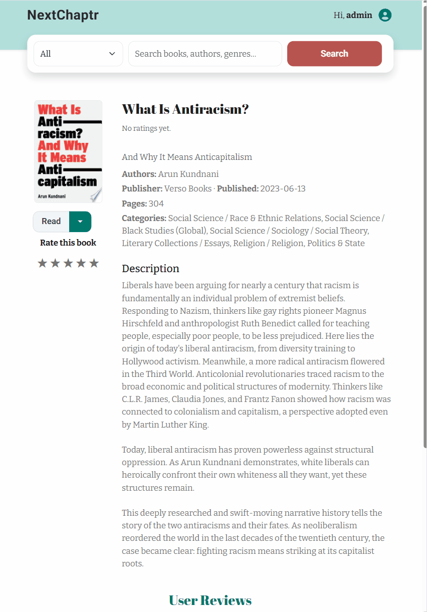
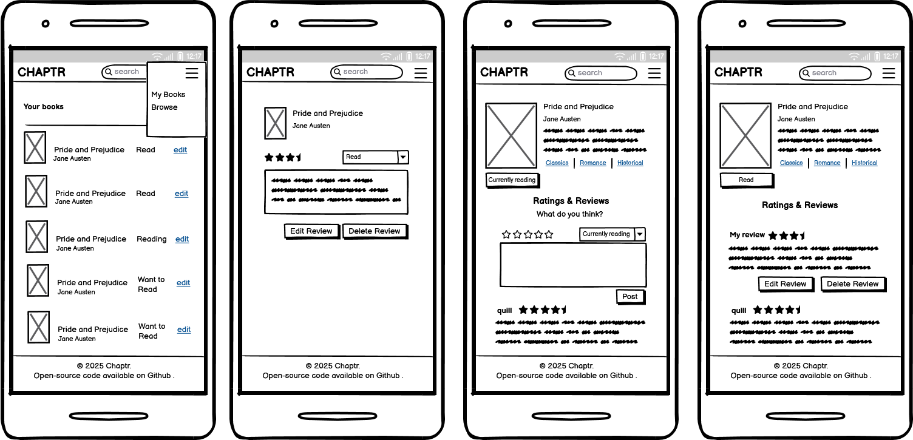
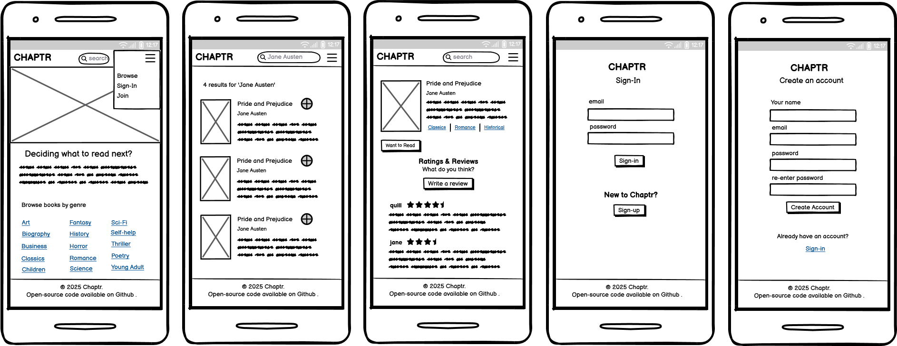

# NextChaptr

**NextChaptr** is a minimalist book-tracking web app that helps readers organize and reflect on their reading journey. Developed as a full-stack project, it highlights key features such as book categorization, rating, and reviewing with modern web technologies.

Unlike feature-heavy platforms, NextChaptr focuses on simplicity, allowing users to manage reading lists (*To Read*, *Reading*, *Read*), rate completed books, and engage through reviews in a clean, distraction-free interface.

---

## Table of Contents

- [Target Audience](#target-audience)
- [Site Goal](#site-goal)
- [Features](#features)
- [Design](#design)
- [Models](#models)
- [Django Project Structure](#django-project-structure)
- [Requirements Overview](#requirements-overview)
  - [Epic 1: Book Discovery and Browsing](#epic-1-book-discovery-and-browsing)
  - [Epic 2: User Authentication and Permissions](#epic-2-user-authentication-and-permissions)
  - [Epic 3: Book Interaction and Reading Progress](#epic-3-book-interaction-and-reading-progress)
  - [Epic 4: User Library](#epic-4-user-library)
- [Testing](#testing)
- [Bug Fixes](#bug-fixes)
- [Sprint Planning](#sprint-planning)
- [Deployment](#deployment)
- [Credits & References](#credits--references)
- [Acknoledgements](#acknoledgements)

---

## Target Audience

NextChaptr is built for readers who want a focused, user-friendly space to log their reading habits without social clutter or unnecessary complexity.

- **Avid Individual Readers**: book enthusiasts seeking a simple, streamlined platform to log their reading journey.
- **Personal Growth & Self-Reflection Users**: individuals who track reading patterns for insights into interests, habits, and achievements.
- **Busy Readers & Lifelong Learners**: people looking to organize reading lists, track progress effortlessly, and fit reading into daily routines.

---

## Site Goal

**Promote Literacy**

- Provide a simple, engaging platform that motivates users to read more consistently.
- Support users in building sustainable reading habits through progress tracking.

**Promote Culture & Community**

- Highlight the cultural value of reading as both a personal and shared experience.
- Encourage conversations around books, authors, and ideas to foster community.

**Support Reading Management in Busy Routines**

- Help users organize their reading lists and track progress at a glance.
- Offer a lightweight, distraction-free space to balance reading with daily responsibilities.

---

## Features

### Homepage (Banner, Intro & Quick Browse)

A welcoming, responsive landing experience that introduces NextChaptr and funnels visitors into core actions.

- **Responsive hero banner**: A full-width banner sets the brand tone and provides visual context.
- **Clear purpose blurb**: A brief description explains what NextChaptr does and who it’s for.
- **Primary actions up front**: Prominent entry points to search books or sign up/log in.
- **Browse by genre**: Category tiles link directly to filtered search views.


### Search & Browse (API First)

Book discovery is powered by the Google Books API, allowing users to explore a vast catalog with flexible search options.

- **Keyword or field-specific search**: Search by general keywords or refine by title, author, or genre.
- **Smart query handling**: Automatically applies the correct Google Books operators.
- **Clean results**: Thumbnails, titles, and authors in a browsable layout.
- **First-party cover images**: A `/cover/` proxy serves covers from our own domain to avoid third-party requests/cookies and improve Lighthouse privacy scores.
- **Pagination**: Navigate large result sets with ease.
- **Resilient design**: Handles API/network errors gracefully.
- **Caching**: Details are cached for ~1 hour to reduce API calls.
- **Search bar design**: The search form uses a visible select element for query fields. Design inspired by [Booking.com](https://www.booking.com/) and [Goodreads](https://www.goodreads.com/).


<details>
<summary>More images</summary>


</details>

### Book Detail View

Each book has a dedicated detail page with enriched information for readers.

- **Comprehensive metadata**: Title, subtitle, authors, publisher, publication date, page count, categories, description, and cover image.
- **First-party cover images**: Served via the `/cover/` proxy to avoid third-party cookies.
- **Performance boost**: Uses Django caching to store details for one hour, reducing API calls while keeping data fresh.
- **Seamless access**: Linked directly from search results for a smooth browsing experience.
- **Page design**: Follows common hierarchies used in other content hubs (e.g., IMDb, Letterboxd, Goodreads, Amazon). The image appears in the top-left, core metadata at the top, primary actions and ratings below the cover, and longer-form reviews lower on the page.


### Reading Progress (Status Updates)

Track progress with a simple three-state flow.

- **Three statuses**: *To Read*, *Reading*, *Read* (`TO_READ`, `READING`, `READ`). One status per `(user, book)`.
- **Inline controls**: Posting a valid status creates/updates a `ReadingStatus`; invalid choices show a friendly error and redirect back to the detail page.
- **Remove from library**: Sending `status=NONE` deletes the status and **archives** any rating/review for that book (kept for analytics, hidden from UI).
- **Book FK safety**: Status changes ensure a `Book` row exists via `fetch_or_refresh_book(...)`.
- **Integrity & performance**: Unique constraint on `(user, book)` with helpful indexes for library queries.
- **UX feedback**: Success/error messages confirm actions and return users to the originating page.
- **Button design**: *To Read* is emphasized as the primary action (a common first step). Other statuses are accessible via a dropdown (the arrow hints at additional options).


<details>
<summary>More images</summary>


</details>

### Rating System

Provide quick feedback and aggregate community sentiment.

- **Star ratings (1–5)**: Authenticated users can create/update a rating; `rating=0` removes it. Values outside 1–5 display a validation message.
- **Status invariant**: Posting a rating ensures a `ReadingStatus` exists (defaults to **READ** if missing). Existing statuses are respected.
- **Archive on removal**: Removing a status archives the user’s rating (`is_archived=True`, timestamped) so it disappears from UI but remains for analytics. Re-posting unarchives the most recent row.
- **Averages & counts**: Helpers compute average rating and total ratings for display on the book detail.
- **User feedback**: Notifications confirm when a rating is saved or updated.
- **Rating buttons design**: The star format and hover animation are inspired by Letterboxd and Goodreads for familiarity.



<details>
<summary>More images</summary>


</details>

### Review System

Let readers share longer-form thoughts with an edit-friendly flow.

- **Single, text-based review**: One review per user/book.
- **Inline compose, edit & delete**: No review → a form appears. With a review → *Edit* and *Delete* buttons.
- **One-per-book guarantee**: A unique `(user, book)` constraint updates on resubmission (no duplicates).
- **Status invariant**: Posting a review ensures a status row exists (defaults to **READ** if missing).
- **Archive on removal**: Removing a status archives the user’s review (`is_archived=True`, timestamped). Re-posting unarchives the most recent row.
- **Ownership guard**: Only the author can delete their review; unauthorized deletes return `403`.


### Library

A personal library displays all books a user is interested in, grouped by reading status.

- **Grouped by status**: *To Read*, *Reading*, and *Read*.
- **First-party cover images**: Served via `/cover/` to avoid third-party cookies.
- **UX note**: “Remove from Library” opens a confirmation dialog that explains rating/review will be removed from the profile (archived, not permanently deleted).
- **Dynamic updates**: The library view reflects changes immediately.
- **Links to details**: Each book links to its detail page.


<details>
<summary>More images</summary>


</details>

### Confirmation Modals

Critical actions (e.g., removing a book from the library or deleting a review) are protected by confirmation modals.

- **Clear messaging**: Modals explain consequences.
- **User control**: Confirm or cancel to retain control.
- **Reusable component**: Implemented as a template partial for consistency.
- **Design rationale**: Follows UX best practices to prevent accidental destructive actions.


### Authentication (Login, Logout & Sign Up)

User authentication is powered by **Django Allauth** for a secure and reliable account experience.

- **Sign up**: New users can create an account. The template is customized to match the site’s brand.
- **Login / Logout**: Access personal features and log out securely.
- **Consistent UI**: Allauth templates are adapted to the project’s design system.


<details>
<summary>More images</summary>


</details>

### Custom Error Pages

Custom error pages maintain brand styling.

- **Clear error**: Pages state the error type.
- **Redirects**: Buttons return users to home or the previous page.
- **Incident number**: Included for help-center communication.


### Admin Panel

- **Books** admin shows minimal cached metadata (id, title, authors, thumbnail, language, published date, fetch markers).
- **Reading statuses** admin shows `(user, book_id, title, status)` with a link to the Google Books page.
- **Rating** admin lists denormalized book titles with quick links to Google Books; supports searching by user, book ID, and title.
- **Review** admin lists support searching by user, book ID/title, and content, with date filters for moderation.

---

## Design

### Fonts

The pairing balances readability and personality. **Bitter** ensures a comfortable reading experience, **Roboto** adds modern clarity for interface text, and **Abril Fatface** adds emphasis.

### Color Palette

The palette draws inspiration from nature for a cozy, calming atmosphere—akin to the feeling of reading.
Green is the primary color, blue the secondary, and terracotta serves as an accent.


### Wireframes

Following a mobile-first approach, wireframes focus on smaller screens. Tablet and desktop designs use the same layout principles while making better use of wider screens, particularly for tables.





---

## Models

The data model balances **external metadata** (from Google Books) with **internal user interactions**.  
Books are only stored locally if a user explicitly saves or interacts with them, keeping the database lightweight.


### User

Uses Django’s built-in `User` model for authentication and ownership of records.

### Book

Represents a book saved in the system (created only when a user adds it to a shelf or sets a reading status).  
The primary key is the Google Books `volumeId`.

**Fields**

- `id`: `CharField`, PK (Google `volumeId`)
- `title`: `CharField`
- `authors`: `TextField` (list of author names)
- `thumbnail_url`: `URLField`
- `language`: `CharField`
- `published_date_raw`: `CharField`
- `etag`: `CharField`
- `last_modified`: `DateTimeField` (HTTP cache header)
- `last_fetched_at`: `DateTimeField` (defaults to now)
- `created_at`: `DateTimeField` (record creation timestamp)
- `updated_at`: `DateTimeField` (auto-updated)

**Meta**

- Index on `title` for faster search.

**Methods**

- `needs_refresh(ttl_minutes=1440)`: checks if book metadata has expired (default TTL: 24 hours).

**Cover storage vs. display**  
The database stores the *remote* `thumbnail_url` only; image bytes are **not** stored.  
At render time, templates use a first-party **cover proxy** to fetch and serve the image from our origin.  
This keeps the DB lightweight and eliminates third-party cookies.  
(A future enhancement could add an `ImageField` to persist files if needed.)

### ReadingStatus

Tracks a user's reading status for a specific book.

**Fields**

- `user`: `ForeignKey` → `User`
- `book`: `ForeignKey` → `Book`
- `status`: `CharField` with choices:
  - `"TO_READ"` → “To Read”
  - `"READING"` → “Reading”
  - `"READ"` → “Read”
- `created_at`: `DateTimeField`
- `updated_at`: `DateTimeField`

**Meta**

- Unique constraint on `(user, book)` → one status per book per user.
- Indexes on `(user, status)`, `(user, book)`, and `status`.

### Rating

Stores a user's rating for a book.

**Fields**

- `user`: `ForeignKey` → `User`
- `book`: `ForeignKey` → `Book`
- `rating`: `PositiveSmallIntegerField` (0–5)
- `created_at`: `DateTimeField`
- `updated_at`: `DateTimeField` (auto_now=True)
- `is_archived`: `BooleanField` (default `False`) — hidden from profile/UI if `True`
- `archived_at`: `DateTimeField` (nullable)

**Meta**

- Unique constraint on `(user, book)` where `is_archived=False` guarantees at most one **active** rating per user/book while allowing archived history.

**Visibility**

- Archived ratings are hidden from the UI but retained for analytics.

### Review

Represents a user's written review of a book.

**Fields**

- `user` (FK): `User`
- `book` (FK): `Book`
- `content`: `TextField`
- `created_at`: `DateTimeField`
- `updated_at`: `DateTimeField` (auto_now=True)
- `is_archived`: `BooleanField` (default `False`)
- `archived_at`: `DateTimeField` (nullable)

**Meta**

- Unique constraint on `(user, book)` where `is_archived=False`.

**Visibility**

- Archived reviews are hidden from the UI but retained for analytics.

---

## Django Project Structure

The *NextChaptr* project is divided into focused Django applications to ensure clear separation of concerns and maintainable architecture.

### apps/

| App Name   | Responsibility                                                                                         |
|------------|---------------------------------------------------------------------------------------------------------|
| `accounts` | Authentication for now; will hold profile features in the future                                        |
| `books`    | Google Books search/detail, minimal cached `Book`, admin, services, cover proxy endpoint (`/cover/`)    |
| `activity` | Per-user `ReadingStatus`, `Rating`, `Review` persistence + admin                                        |
| `library`  | Displays user-specific reading activity grouped by status                                               |

### Image Delivery & Privacy

To avoid third-party cookies flagged by Lighthouse, cover images are served **first-party**:

- **Endpoint**: `GET /cover/?url=<encoded-remote-url>`
- **Behavior**: Server fetches the remote image (enforces HTTPS), whitelists Google hosts, and returns bytes with long-lived caching headers.
- **Templates**: Use `book.cover_url` or fall back to a local placeholder.

This affects **Search Results**, **Book Detail**, and **Library** templates and the corresponding views that compute `cover_url` for each book.

### State Changes via Services

Lifecycle rules (e.g., “rating implies a status exists” or “removing status archives rating/review”) are implemented in a **service layer**. This makes behavior explicit, testable, and easy to evolve.

Key functions:

- `remove_from_library(user, book_id)` — deletes the status and **archives** the user’s rating/review for that book.
- `upsert_active_rating(user, book_id, value)` — creates or **unarchives** the latest rating, ensuring a status exists.
- `upsert_active_review(user, book_id, content)` — creates or **unarchives** the latest review, ensuring a status exists.

### Design Rationale

- **Modular design**: Each app reflects a distinct domain of the system and aligns with a major feature group (search, authentication, interaction, UI).
- **Separation of concerns**: Each app encapsulates its own models, views, and templates.
- **Maintainability**: Clear boundaries reduce complexity and improve readability.
- **Scalability**: Supports future extensions (e.g., a social/friendship app) without disrupting core architecture.

---

## Requirements Overview

Below is a summary of the planned development scope using Agile epics, user stories, and tasks.

---

### Epic 1: [Book Discovery and Browsing](https://github.com/larevolucia/chaptr/issues/1)

**Goal**: Enable users to explore the book catalog using a search interface powered by the Google Books API.

#### [Search for books by title, author](https://github.com/larevolucia/chaptr/issues/6)

**Technical Tasks**
- [Implement search form and view](https://github.com/larevolucia/chaptr/issues/19)
- [Integrate Google Books API](https://github.com/larevolucia/chaptr/issues/20)
- [Display search results](https://github.com/larevolucia/chaptr/issues/21)

#### [View book details](https://github.com/larevolucia/chaptr/issues/7)

**Technical Tasks**
- [Create book detail view](https://github.com/larevolucia/chaptr/issues/22)
- [Style Book Detail Page](https://github.com/larevolucia/chaptr/issues/23)
- [Populate data from API or local cache](https://github.com/larevolucia/chaptr/issues/24)

#### [View reviews on books](https://github.com/larevolucia/chaptr/issues/8)

**Technical Tasks**
- [Create review model and form](https://github.com/larevolucia/chaptr/issues/43)
- [Display reviews in template](https://github.com/larevolucia/chaptr/issues/44)

#### [Prompt login when guests try to interact](https://github.com/larevolucia/chaptr/issues/9)

**Technical Tasks**
- [Add login checks to views](https://github.com/larevolucia/chaptr/issues/25)
- [Add login prompt messaging](https://github.com/larevolucia/chaptr/issues/26)

---

### Epic 2: [User Authentication and Permissions](https://github.com/larevolucia/chaptr/issues/2)

**Goal**: Set up account registration, login/logout, and protect user actions.

#### [Register an account](https://github.com/larevolucia/chaptr/issues/10)

**Technical Tasks**
- [Create registration form and view](https://github.com/larevolucia/chaptr/issues/29)
- [Handle form validation and feedback](https://github.com/larevolucia/chaptr/issues/30)
- [Link registration in navbar](https://github.com/larevolucia/chaptr/issues/31)

#### [Log in and log out securely](https://github.com/larevolucia/chaptr/issues/11)

**Technical Tasks**
- [Create login and logout views](https://github.com/larevolucia/chaptr/issues/32)
- [Update navbar based on auth status](https://github.com/larevolucia/chaptr/issues/33)
- [Handle redirection after login/logout](https://github.com/larevolucia/chaptr/issues/34)

#### [Restrict book interactions to authenticated users](https://github.com/larevolucia/chaptr/issues/12)

**Technical Tasks**
- [Add `@login_required` to protected views](https://github.com/larevolucia/chaptr/issues/36)
- [Update templates to show/hide based on login state](https://github.com/larevolucia/chaptr/issues/35)

---

### Epic 3: [Book Interaction and Reading Progress](https://github.com/larevolucia/chaptr/issues/3)

**Goal**: Allow users to track their reading activity, rate books, and comment.

#### [Mark books as To Read, Reading, or Read](https://github.com/larevolucia/chaptr/issues/13)

**Technical Tasks**
- [Create reading status and review models](https://github.com/larevolucia/chaptr/issues/37)
- [Add forms for status, rating, and reviewing](https://github.com/larevolucia/chaptr/issues/38)
- [Display and update user content](https://github.com/larevolucia/chaptr/issues/39)

#### [Rate books](https://github.com/larevolucia/chaptr/issues/14)

**Technical Tasks**
- [Add rating field to reading model or separate model](https://github.com/larevolucia/chaptr/issues/40)
- [Create form and view logic for adding/updating rating](https://github.com/larevolucia/chaptr/issues/41)
- [Show rating summary on book detail](https://github.com/larevolucia/chaptr/issues/42)

#### [Leave a review](https://github.com/larevolucia/chaptr/issues/15)

**Technical Tasks**
- [Create review model and form](https://github.com/larevolucia/chaptr/issues/43)
- [Display reviews in template](https://github.com/larevolucia/chaptr/issues/44)

#### [Edit and delete reviews](https://github.com/larevolucia/chaptr/issues/16)

**Technical Tasks**
- [Validate review ownership](https://github.com/larevolucia/chaptr/issues/45)
- [Implement update and delete views for reviews](https://github.com/larevolucia/chaptr/issues/46)
- [Add conditional logic in templates for ownership](https://github.com/larevolucia/chaptr/issues/47)
- [Add messaging and UI confirmation for deletion](https://github.com/larevolucia/chaptr/issues/48)

---

### Epic 4: [User Library](https://github.com/larevolucia/chaptr/issues/4)

**Goal**: Provide users with a personalized library to manage their reading activity.

#### [View books grouped by reading status](https://github.com/larevolucia/chaptr/issues/17)

**Technical Tasks**
- [Create library view with user authentication](https://github.com/larevolucia/chaptr/issues/49)
- [Build styled library template](https://github.com/larevolucia/chaptr/issues/50)
- [Query and display grouped book data](https://github.com/larevolucia/chaptr/issues/51)

#### [Update reading status directly from library](https://github.com/larevolucia/chaptr/issues/18)

**Technical Tasks**
- [Add inline status update controls](https://github.com/larevolucia/chaptr/issues/52)
- [Implement status update logic in view](https://github.com/larevolucia/chaptr/issues/53)
- [Show success messages after updates](https://github.com/larevolucia/chaptr/issues/54)

---

## Testing

**NextChaptr** includes a comprehensive suite of automated tests to ensure reliability and maintainability across core features. Tests are written using **Django’s `TestCase`** framework with mocking for external dependencies such as the Google Books API.

Detailed testing documentation can be found in [TESTS.md](documentation/TESTS.md).


### Automated Test Coverage

- **Authentication Tests (Allauth)**
  - **Sign-up flow**: page rendering, successful account creation, and validation errors (duplicate username, short passwords, mismatches).
  - **Login flow**: correct credentials, invalid credentials, and required validation checks.
  - **Logout flow**: proper behavior when logged in or out.
  - **Password reset**: form rendering and email delivery.

- **Books App Tests**
  - **Query building**: correct application of search operators (`intitle`, `inauthor`, `subject`).
  - **Search view**: integration with `search_google_books`, correct rendering of results.
  - **Google Books API integration**: parsing of valid responses; handling of failed requests.
  - **Book detail view**: correct mapping of metadata fields, 404 behavior for missing books, and caching to reduce API calls.
  - **Home page**: correct rendering of template, hero, about area, featured genres, and search functionality.

- **Book Search Pagination**
  - **Page size**: `PER_PAGE = 12` drives both the Google Books query (`max_results=12`) and Django paginator.
  - **First page**: `?q=django&field=all&page=1` triggers `search_google_books("django", start_index=0, max_results=12)`; `page_obj.number == 1`, `start_index()==1`, `end_index()==12`.
  - **Second page**: `?q=python&field=all&page=2` triggers `search_google_books("python", start_index=12, max_results=12)`; `page_obj.number == 2`, `start_index()==13`, `end_index()==24` when total is 30.
  - **Template context**: view provides `page_obj`, `paginator`, `is_paginated`, and `page_range`; `paginator.count == total`, `paginator.per_page == 12`, `is_paginated` is `True`, and the rendered page’s `object_list` length equals `PER_PAGE`.

- **Genre Browsing & Search Integration**
  - **Home genre links**: subject links formatted as `/book_search?field=subject&q=<urlencoded>`, with `class="stretched-link"` and accessible `aria-label`s (e.g., Sci-Fi, Mystery).
  - **Subject filter mapping**: clicking a genre (e.g., “science fiction”) calls `search_google_books("subject:science fiction", start_index=0, max_results=12)`.
  - **Pagination preserves filters**: page 2 for `subject=mystery` calls `search_google_books("subject:mystery", start_index=12, max_results=12)`; pagination links keep `field=subject&q=mystery`.
  - **Active page semantics**: current page number renders as an active `<span>`; other page numbers remain links retaining subject params.

- **ReadingStatus Tests**
  - **Anonymous users see login CTA**: detail view renders “Log in to add” and links to the login page.
  - **Valid choices can be set**: authenticated users can set `"TO_READ"`, `"READING"`, or `"READ"`.
  - **Creating a status**: posting a valid status creates a `ReadingStatus` for the `(user, book)` pair.
  - **Unauthenticated redirects**: posting without authentication redirects to login and does **not** create a status.
  - **Removing a status with safe `next`**: `status=NONE` deletes the row and safely redirects to a same-site `next` URL.
  - **Removing a status without `next`**: falls back to the book detail page.
  - **Unsafe `next` is ignored**: off-site `next` URLs are rejected; falls back to the detail page.

- **Rating Tests**
  - **Unauthenticated redirects**: posting a rating without logging in redirects to login and does **not** create a record.
  - **Creating a rating**: authenticated users can post a rating, which creates a `Rating` and redirects to the book detail.
  - **Updating a rating**: posting a new value overwrites the existing `Rating` (no duplicates).
  - **Removing a rating**: posting `rating=0` deletes the record and redirects back to the detail.
  - **Auto-create status**: rating without an existing `ReadingStatus` creates `READ`.
  - **Respect existing status**: existing `ReadingStatus` is not changed.

- **Review Tests**
  - **Creating a review**: POST to `/books/<book_id>/review/` saves and redirects; one new `Review` for `(user, book)`.
  - **Book detail displays reviews**: detail view lists reviews; content and author appear in “User Reviews.”
  - **Anonymous users see login CTA**: “Log in to leave a review”; CTA present and no `<form>`.
  - **Authenticated users see add review form**: no existing review → textarea rendered; form action targets `add_review`.
  - **Editing a review (no duplicates)**: second POST updates existing row; still exactly one `Review`.
  - **Creates READ status when missing**: posting a review with no status auto-creates `READ`.
  - **Respects existing status**: does not override an existing status (e.g., **READING**).
  - **Delete ownership check**: only the author can delete.
  - **Delete confirmation**: modal confirmation before delete.
  - **Delete success**: review removed; success message displayed.

- **Archive Flow**
  - **Status removal**: removing a status archives rating and review (deletes only the status).
  - **Status persistence**: posting a new rating/review unarchives the latest archived row and ensures a status exists.
  - **UI behavior**: the UI ignores archived ratings; detail, search results, and library hide archived reviews.

- **Library Tests**
  - **Viewing the library**: users see all books organized by status.
  - **Empty states**: appropriate messages when no books exist in a status.
  - **Multiple statuses**: sections render correctly.
  - **Book details**: links navigate to detail pages.
  - **Access control**: only authenticated users can access their library; unauthenticated users are redirected to login.

### Automated Test Approach

- **Isolation**: external API calls are mocked for speed and determinism.
- **Resilience**: cache is cleared between tests to avoid cross-test interference.
- **Realism**: sample JSON payloads (e.g., `REALISTIC_DETAIL_JSON`) simulate Google Books responses for reliable field mapping tests.

Run tests with:

```bash
python manage.py test --settings=chaptr.settings_test
```

These tests provide confidence that authentication flows and book-related features behave as expected.

---

### Manual Testing

**Book Discovery & Search**

| Test Case            | Input                                          | Expected Outcome                                                                     | Status |
| :------------------- | :--------------------------------------------- | :----------------------------------------------------------------------------------- | :----: |
| Navigate genre tile  | Click on "Classics" tile                       | Search `/search/?field=subject&q=classics`                                           |    ✅   |
| Search by title      | Select "title" and type "Little Women"         | Search `/search/?field=title&q=Little+Women`                                         |    ✅   |
| Search by author     | Select "author" and type "John Grisham"        | Search `/search/?field=author&q=John+Grisham`                                        |    ✅   |
| Search by genre      | Select "genre" and type "political"            | Search `/search/?field=subject&q=political`                                          |    ✅   |
| General search       | Select "all" and type "Fellowship of the Ring" | Search `/search/?field=all&q=Fellowship+of+the+Ring`                                 |    ✅   |
| View book detail     | Click on "The Fellowship of the Ring"          | Page renders with author, description, publisher, pages, categories, publishing date |    ✅   |
| Login to add book    | Click on "Log in to add"                       | Redirects to `accounts/login` with `/?next=/search`                                  |    ✅   |
| Login to rate book   | Click on stars to add a rating                 | Redirects to `accounts/login` with `/?next=/search/`                                 |    ✅   |
| Login to review book | Click on "Log in" hyperlink                    | Redirects to `accounts/login` with `?next=/books/`                                   |    ✅   |

**Authentication**

| Test Case          | Input                                                                 | Expected Outcome                                             | Status |
| :----------------- | :-------------------------------------------------------------------- | :----------------------------------------------------------- | :----: |
| Sign up            | Add temp email, username & password                                   | Redirect to `/accounts/confirm-email/` and receive email     |    ✅   |
| Email verification | Click "verify your email" link → `/accounts/confirm-email/` → confirm | Alert `You have confirmed {account}`, then redirect to login |    ✅   |
| Log in             | Enter username and password                                           | Display success message; redirect to `/library/`             |    ✅   |
| Log out (menu)     | Header icon → open menu → "Sign out"                                  | Redirect to `/accounts/logout/`                              |    ✅   |
| Log out (button)   | On `/accounts/logout/` click "Sign out"                               | Successfully signs out and shows alert                       |    ✅   |

**Library**

| Test Case     | Input                                                                                        | Expected Outcome                                                 | Status |
| :------------ | :------------------------------------------------------------------------------------------- | :--------------------------------------------------------------- | :----: |
| First login   | Enter username and password                                                                  | Redirect to `/library/` and show empty library message           |    ✅   |
| Sort titles   | Library with multiple books/statuses → click "Status" header                                 | Re-orders books by status (descending: To Read / Reading / Read) |    ✅   |
| Filter titles | Library with multiple statuses → click "Read" filter                                         | Shows only books with status "Read"                              |    ✅   |
| Change status | Library → book with "To Read" → dropdown next to "View" → "Change Status" → select "Reading" | Updates status and shows confirmation                            |    ✅   |
| Review book   | Library → dropdown next to "View" → "Write a Review"                                         | Redirects to book page `#reviews`                                |    ✅   |
| Rate book     | Library → dropdown next to "View" → "Rate"                                                   | Redirects to book page                                           |    ✅   |
| Remove book   | Library → dropdown next to "View" → "Change Status" → "Remove from Library"                  | Confirmation modal shows with correct content                    |    ✅   |

**Review**

| Test Case                | Input                                                                      | Expected Outcome                                | Status |
| :----------------------- | :------------------------------------------------------------------------- | :---------------------------------------------- | :----: |
| Review form              | Search `title:jellyfish age backwards` → first item `/books/wYswEAAAQBAJ/` | Sees reviews and form                           |    ✅   |
| Leave review (no status) | On `/books/wYswEAAAQBAJ/` write and submit “awesome”                       | Page updates, alert shown, status becomes READ  |    ✅   |
| Edit review              | On `/books/wYswEAAAQBAJ/` click edit, change to “not so awesome”, save     | Review updated; alert shown                     |    ✅   |
| Delete review            | On `/books/wYswEAAAQBAJ/` click delete                                     | Confirmation modal shown with correct messaging |    ✅   |
| Cancel delete            | Click "Cancel"                                                             | Review is not deleted                           |    ✅   |
| Confirm delete           | Click "Yes, proceed"                                                       | Review deleted; success alert shown             |    ✅   |

**Rating**

| Test Case          | Input                                              | Expected Outcome                                                                     | Status |
| :----------------- | :------------------------------------------------- | :----------------------------------------------------------------------------------- | :----: |
| See rating average | `/books/wYswEAAAQBAJ/`                             | Rating average displayed                                                             |    ✅   |
| Rate book          | `/books/wYswEAAAQBAJ/` → click stars to rate **4** | Average and count update; stars change to filled for the given rating; success alert |    ✅   |
| Update rating      | `/books/wYswEAAAQBAJ/` → change to **3**           | Average updates; count remains; stars reflect new rating; success alert              |    ✅   |
| Delete rating      | `/books/wYswEAAAQBAJ/` → click the **x**           | Average and count update; stars change to the gray state; info alert                 |    ✅   |

**Status Update**

| Test Case               | Input                                                                  | Expected Outcome                              | Status |
| :---------------------- | :--------------------------------------------------------------------- | :-------------------------------------------- | :----: |
| Set status on search    | Search “old man and the sea” → click “To Read” button on a result item | Status updated; success alert shown           |    ✅   |
| Change status on search | On the same item, change from “To Read” to “Reading”                   | Status updated; success alert shown           |    ✅   |
| Remove status on search | On the same item, remove from library                                  | Confirmation modal shown with correct content |    ✅   |
| Cancel status removal   | In the confirmation modal, click “Cancel”                              | Item retains its status                       |    ✅   |
| Confirm status removal  | In the confirmation modal, click “Yes, proceed”                        | Modal closes; status cleared                  |    ✅   |

---

## Bug Fixes

**[500 Error in signup](https://github.com/larevolucia/chaptr/issues/84)**  
Mandatory confirmation email was not being sent due to issues with Gmail credentials. Resolved by regenerating the credentials and updating both `.env` and Heroku config vars.

**[Admin search for Activity gives 500 error](https://github.com/larevolucia/chaptr/issues/78)**  
Admin search returned a 500 error. Resolved by correcting search field formatting.

**[Internal Server Error](https://github.com/larevolucia/chaptr/issues/89)**  
Production returned a 500 error due to missing variables after refactoring. Resolved by adding `GOOGLE_BOOKS_SEARCH_URL` and `GOOGLE_BOOKS_VOLUME_URL` to Heroku config vars.

**[Books tests_views failing after activity changes](https://github.com/larevolucia/chaptr/issues/79)**  
Book views crashed in tests because `RequestFactory` requests lack `request.user`, causing `AttributeError` in `book_search`/`book_detail`. Fixed by defaulting to `AnonymousUser` (e.g., `user = getattr(request, "user", AnonymousUser())`) before any `is_authenticated` checks in `books/views.py`.

**[API response for totalItems is inconsistent](https://github.com/larevolucia/chaptr/issues/81)**  
Pagination broke due to Google Books API returning inflated `totalItems`. Fixed by capping results to the fetched items and adjusting pagination logic.

**[Message "No reviews yet" after reviews](https://github.com/larevolucia/chaptr/issues/77)**  
Authenticated users saw “No reviews yet” after their own review due to template logic. Fixed by rendering the user’s review first and only showing the empty state when neither `my_review` nor any `reviews` exist.

**[Cover fallback not displaying](https://github.com/larevolucia/chaptr/issues/55)**  
Cover fallback failed in production. Resolved by removing static files from `.gitignore` and correcting directory paths.

**[Notifications make the screen jump down](https://github.com/larevolucia/chaptr/issues/70)**  
Alerts caused layout shift. Fixed by converting them to fixed-position toasts (high z-index), so messages float without pushing content.

**[Login via search results redirects to empty search](https://github.com/larevolucia/chaptr/issues/69)**  
Login from search redirected to an empty results page because the `next` parameter wasn’t preserved. Fixed by passing the original query in the login redirect.

**[Models inconsistency](https://github.com/larevolucia/chaptr/issues/69)**  
Removing a book only cleared its reading status, leaving review/rating behind. Fixed by cascading cleanup on status removal and archiving associated review and rating records.

**[Search returns duplicated results](https://github.com/larevolucia/chaptr/issues/91)**  
Search results showed duplicates when the query was too specific. Fixed by de-duplicating results before pagination.

---

### [Linters and Validation Fixes](https://github.com/larevolucia/chaptr/issues/87)

**[HTML W3C Validator](https://validator.w3.org/)**

| Page            | Warning / Error                                                           | Fix                                                     |
|:----------------|:--------------------------------------------------------------------------|:--------------------------------------------------------|
| Home            | Error: Parse Error. `</body>↩</html>↩`                                   | Removed extra whitespace after `</html>` in `base.html` |
| Home            | The `navigation` role is unnecessary for `nav`                            | Removed from `base.html`                                |
| Home            | The `region` role is unnecessary for `section`                            | Removed from `home.html`                                |
| Home            | The `contentinfo` role is unnecessary for `footer`                        | Removed from `base.html`                                |
| Search Results  | End tag `h2` seen, but there were open elements                           | Corrected `</h2>` to `</h1>`                            |
| Search Results  | `sizes` must only be specified if `srcset` is specified                   | Removed `sizes`                                         |
| Search Results  | End tag `h5` seen, but there were open elements                           | Corrected `</h5>` to `</h1>`                            |
| Search Results  | Duplicated book id error                                                  | De-duplicated search output in `books/views.py`         |
| Book Detail     | Error: Unclosed `div`                                                     | Closed the `div`                                        |
| Book Detail     | Parse error                                                               | Wrapped `{{ book.description|safe }}` in a `<div>`      |
| Book Detail     | Duplicate ID `confirmDeleteModal`                                         | Removed included modal partial from `reviews.html`      |

<details>
<summary>Home (auth)</summary>


</details>

<details>
<summary>Home (visitor)</summary>


</details>

<details>
<summary>Search Results (auth)</summary>


</details>

<details>
<summary>Search Results (visitor)</summary>


</details>

<details>
<summary>Book Detail (auth)</summary>

  
  

</details>

<details>
<summary>Book Detail (visitor)</summary>

  

</details>

<details>
<summary>Library (auth)</summary>

  

</details>

**[Jigsaw](https://jigsaw.w3.org/)**

| Line | Warning                                                   | Fix                    |
|-----:|:----------------------------------------------------------|:-----------------------|
|  183 | `background-color: none` is not a valid value             | Changed to `transparent` |
|  766 | `background-color: color-mix(...)` not valid here         | Changed to `transparent` |
| 549, 564 | The `clip` property is deprecated                     | Removed `clip`; kept `clip-path` |

<details>
<summary>CSS</summary>


</details>

**Lighthouse**

| Page                         | Warning / Issue                                                                                          | Fix                                                                                 |
|:-----------------------------|:----------------------------------------------------------------------------------------------------------|:------------------------------------------------------------------------------------|
| Home                         | Deprecation/Warning: `<h1>` inside an `article/aside/nav/section` without explicit font-size             | Added explicit font-sizes in CSS                                                    |
| Search Results & Book Detail | Mixed content: some resources loaded over HTTP while the page is HTTPS                                   | Introduced `ensure_https` to secure Google Books cover URLs                         |
| Search Results & Book Detail | Third-party cookies via Google cover images                                                              | Implemented a `/cover/` proxy view and URL to serve images first-party              |

<details>
<summary>Home</summary>

  
  
  

</details>

<details>
<summary>Search</summary>

  
  
  

</details>

<details>
<summary>Book Page</summary>

  
  
  

</details>

<details>
<summary>Library</summary>

  
  
  

</details>

### [PEP8](https://pep8ci.herokuapp.com/#)

All files passed PEP8 validation. Screenshots can be found in the [PEP8 folder](documentation/images/validators/pep8/).

---

## Sprint Planning

Sprints deliver features incrementally, each focusing on specific epics and user stories. The sprint timebox is one week.

All issues are tracked on the GitHub project board:  
https://github.com/larevolucia/chaptr/projects/12

### Sprint 0: Project Setup

- [x] Create epics, user stories, and tasks in GitHub  
- [x] Set up Django project and apps  
- [x] Configure Google Books API integration  
- [x] Deploy initial version to Heroku  
- [x] Set up Postgres database  
- [x] Set up basic templates and static files

### Sprint Breakdown

**Sprint 1**

- Epic 1: Book Discovery and Browsing  
  - [x] [Search for books by title, author, genre](https://github.com/larevolucia/chaptr/issues/6)  
  - [x] [View book details](https://github.com/larevolucia/chaptr/issues/7)  
  - [x] [Homepage – MVP](https://github.com/larevolucia/chaptr/issues/56)

- Epic 2: User Authentication and Permissions  
  - [x] [Register an account](https://github.com/larevolucia/chaptr/issues/10)  
  - [x] [Log in and log out securely](https://github.com/larevolucia/chaptr/issues/11)

**Sprint 2**

- Epic 1: Book Discovery and Browsing  
  - [x] [Prompt login when guests try to interact](https://github.com/larevolucia/chaptr/issues/9)  
  - [x] [Homepage – Stretch](https://github.com/larevolucia/chaptr/issues/56)
- Epic 2: User Authentication and Permissions  
  - [x] [Restrict book interactions to authenticated users](https://github.com/larevolucia/chaptr/issues/12)
- Epic 3: Book Interaction and Reading Progress  
  - [x] [Mark books as To Read, Reading, or Read](https://github.com/larevolucia/chaptr/issues/13)  
  - [x] [Rate books](https://github.com/larevolucia/chaptr/issues/14)  
  - [x] [Leave a review](https://github.com/larevolucia/chaptr/issues/15)

**Sprint 3**

- Epic 1: Book Discovery and Browsing  
  - [x] [View reviews on books](https://github.com/larevolucia/chaptr/issues/8)
- Epic 3: Book Interaction and Reading Progress  
  - [x] [Edit and delete reviews](https://github.com/larevolucia/chaptr/issues/16)
- Epic 4: User Dashboard  
  - [x] [View books grouped by reading status](https://github.com/larevolucia/chaptr/issues/17)  
  - [x] [Update reading status directly from dashboard](https://github.com/larevolucia/chaptr/issues/18)

**Sprint 4**

- Testing and Bug Fixes  
  - [x] [Refactoring](https://github.com/larevolucia/chaptr/issues/85)  
  - [x] [Accessibility & Performance](https://github.com/larevolucia/chaptr/issues/87)  
  - [ ] [Documentation](https://github.com/larevolucia/chaptr/issues/88)

---

## Deployment

### 1. Clone the Repository

```bash
git clone https://github.com/larevolucia/chaptr.git
cd chaptr
```

Verify your Python version:

```bash
python3 --version
```

> **Note:** This project requires Python 3.12+ (see `.python-version`).

---

### 2. Set Up a Virtual Environment

```bash
python3 -m venv venv
# Activate:
# Windows
venv\Scripts\activate
# macOS/Linux
source venv/bin/activate
```

---

### 3. Install Dependencies

```bash
pip install -r requirements.txt
```

---

### 4. Configure Environment Variables

Create a `.env` file in the project root with the following variables:

#### Google Books API

1. Go to the [Google Cloud Console](https://console.cloud.google.com/).
2. Create a new project ([guide](https://developers.google.com/workspace/guides/create-project)).
3. Enable the **Google Books API** (`APIs & Services > Library`).
4. Generate an **API key** (`APIs & Services > Credentials`).

Add the key and URLs to `.env`:

```bash
GOOGLE_BOOKS_API_KEY=<YOUR_KEY>
GOOGLE_BOOKS_SEARCH_URL=https://www.googleapis.com/books/v1/volumes
GOOGLE_BOOKS_VOLUME_URL=https://www.googleapis.com/books/v1/volumes/{}
```

#### Django Secrets

```bash
SECRET_KEY=<YOUR_DJANGO_SECRET_KEY>
DATABASE_URL=<YOUR_DATABASE_URL>
```

#### Email Settings (Optional)

For local testing you can disable email confirmation in `settings.py`:

```python
ACCOUNT_EMAIL_VERIFICATION = "none"
```

For production email (example with Gmail App Password):

```bash
EMAIL_BACKEND=django.core.mail.backends.smtp.EmailBackend
EMAIL_HOST=smtp.gmail.com
EMAIL_PORT=587
EMAIL_USE_TLS=True
EMAIL_HOST_USER=<YOUR_EMAIL_ADDRESS>
EMAIL_HOST_PASSWORD=<YOUR_APP_PASSWORD>
DEFAULT_FROM_EMAIL=<YOUR_EMAIL_ADDRESS>
```

---

### 5. Collect Static Files

Before deploying (using [WhiteNoise](https://whitenoise.readthedocs.io/)):

```bash
python manage.py collectstatic --noinput
```

---

### 6. Deploy to Heroku

1. Create a new Heroku app.
2. Add the **Heroku Python buildpack** under **Settings > Buildpacks**.
3. Add environment variables from `.env` to **Heroku Config Vars**.
4. Deploy.

---

That’s it! The app should now be live on Heroku.

---

## Credits & References

* Homepage banner image: [Unsplash](https://unsplash.com/photos/iyKVGRu79G4) — Photo by [Lilly Rum](https://unsplash.com/@rumandraisin?utm_content=creditCopyText&utm_medium=referral&utm_source=unsplash)
* Google Books API: [Google Developers](https://developers.google.com/books/docs/v1/getting_started)
* Color palette: [Material Palette](https://www.materialpalette.com/teal/deep-orange)
* Favicon: [Favicon.io](https://favicon.io/favicon-converter/)
* Favicon art by [Good Ware](https://www.flaticon.com/authors/good-ware)
* ChatGPT: [OpenAI](https://openai.com/chatgpt) for documentation improvement
* Copilot: [GitHub Copilot](https://github.com/features/copilot) for code completion and docstring generation
* Django Allauth: [Django Allauth](https://django-allauth.readthedocs.io/en/latest/)
* Conditional Requests: [MDN Web Docs](https://developer.mozilla.org/en-US/docs/Web/HTTP/Guides/Conditional_requests)
* Session Objects: [Requests Documentation](https://requests.readthedocs.io/en/latest/user/advanced/#conditional-requests)
* Third-party Cookies: [Privacy Sandbox](https://privacysandbox.google.com/cookies/prepare/audit-cookies)
* Custom error handling: [Stack Overflow](https://stackoverflow.com/questions/40758711/how-to-set-a-default-handler-for-csrf-verification-failed-in-django)

## Acknoledgements

Many thanks to my mentor, who always pushed me a little further,especially when I felt there was nothing more I could do. 
I’m also grateful to my colleagues, who generously offered their professional advice and guidance throughout this journey.